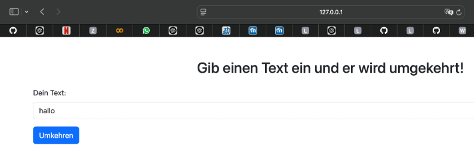
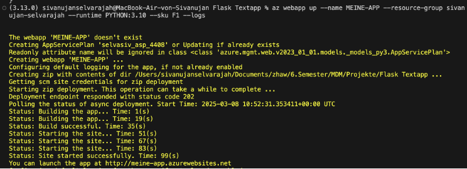

# Lernjournal 1 Python

## Repository und Library

| | Bitte ausfüllen |
| -------- | ------- |
| Repository (URL) | https://github.com/sivanujan-selvarajah/flask-textapp |
| Kurze Beschreibung der App-Funktion | Diese Webanwendung wurde mit Flask entwickelt. Nutzer können einen beliebigen Text eingeben, der vom Backend umgekehrt wird. Die umgekehrte Version wird direkt im Browser angezeigt.  |
| Verwendete Library aus PyPi (Name) | Flask, Werkzeug, Jinja2, MarkupSafe, Click, Blinker, Itsdangerous |
| Verwendete Library aus PyPi (URL) | [Flask](https://pypi.org/project/Flask/)  [Werkzeug](https://pypi.org/project/Werkzeug/)  [Jinja2](https://pypi.org/project/Jinja2/)  [MarkupSafe](https://pypi.org/project/MarkupSafe/)  [Click](https://pypi.org/project/click/)  [Blinker](https://pypi.org/project/blinker/)  [Itsdangerous](https://pypi.org/project/itsdangerous/) |


## Inhaltsverzeichnis

  - [App, Funktionalität](#app-funktionalität)
    - [Funktionsweise](#funktionsweise)
    - [Technische Umsetzung](#technische-umsetzung)
    - [Besonderheiten](#besonderheiten)
  - [Dependency Management](#dependency-management)
    - [Schritte](#schritte)
  - [Deployment](#deployment)
    - [Lokaler Test](#lokaler-test)
    - [Deployment auf Microsoft Azure](#deployment-auf-microsoft-azure)
  - [Dokumentation von Code und Repository](#dokumentation-von-code-und-repository)
    - [Code](#code)
    - [Repository-Struktur](#repository-struktur)
  - [Reflexion](#reflexion)
  - [Quellenverzeichnis](#quellenverzeichnis)
  - [Abbildungsverzeichnis](#️abbildungsverzeichnis)


## App, Funktionalität

Diese Anwendung ist eine einfache Flask-Webanwendung, die es Nutzern ermöglicht, eingegebenen Text umzukehren und das Ergebnis direkt im Browser anzuzeigen.

### Funktionsweise:

- Nutzer geben einen Text ein und klicken auf „Umkehren“.
- Die Eingabe wird an das Flask-Backend übermittelt.
- Der Text wird dort verarbeitet (umgekehrt) und über das Template wieder ausgegeben.

### Technische Umsetzung:

- **Backend:** Flask verarbeitet GET- und POST-Anfragen.
- **Frontend:** HTML & Bootstrap (kein JavaScript-Framework).
- **Verarbeitung:** erfolgt vollständig im Python-Backend (`[::-1]`).

### Besonderheiten:
- Intuitive und einfache Benutzeroberfläche
- Verarbeitung erfolgt vollständig im Backend
- Ergebnisanzeige über Template (Jinja2)
- Nur eine Route (`/`) nötig
- Kein Einsatz von Frontend-Libraries 
- Screenshots dokumentieren den Ablauf im Ordner `images/`

Diese Anwendung entstand als erste praktische Übung mit Flask. Ich wollte eine einfache, aber vollständige Pipeline von Benutzereingabe über Backend-Verarbeitung bis zur Anzeige im Browser umsetzen.

Die Entscheidung für eine Textumkehr-Funktion fiel bewusst, weil sie keinen komplexen Code erfordert, aber den gesamten Ablauf sichtbar macht: Eingabe → Verarbeitung → Ausgabe. Dadurch konnte ich mich auf die Architektur konzentrieren – also die Routen, das HTML-Template und die Kommunikation zwischen Frontend und Backend.

Beim Einrichten der POST-Route hatte ich zunächst Schwierigkeiten mit der Übergabe der Eingabevariable – besonders das Debugging in der request.form-Struktur war anfangs nicht ganz trivial. Durch dieses Problem habe ich aber gelernt, wie wichtig sauberes Logging und das Testen mit minimalen Beispielen ist.

Insgesamt hat mich die Arbeit an dieser App stark an die Webentwicklung mit Python herangeführt, insbesondere der Zusammenspiel zwischen Flask-Logik und HTML-Template war für mich eine wertvolle Lernerfahrung.

---

## Dependency Management

Die Abhängigkeiten wurden mit einer **virtuellen Umgebung (`venv`)** verwaltet, um sicherzustellen, dass keine globalen Pakete das Projekt beeinflussen.

### Schritte:

1. Erstellung & Aktivierung des virtuellen Environments (`python -m venv venv`)
2. Installation von Flask: `pip install flask`
3. Verwendung von `requirements.in` zur Verwaltung der Basis-Abhängigkeiten
4. Generierung von `requirements.txt` mit `pip-compile` (aus `pip-tools`)
5. Installation aller Abhängigkeiten mit: `pip install -r requirements.txt`


  
**Abb. 1:** Generierte `requirements.txt` nach `pip-compile`

  
**Abb. 2:** Terminal-Ausgabe beim Erstellen der `requirements.txt`

Alle Packages wurden mit festen Versionen definiert, um reproduzierbare Installationen auf jedem System sicherzustellen.

Für das Dependency Management habe ich pip-tools verwendet, um ein reproduzierbares Setup zu erreichen. Die Trennung von requirements.in und requirements.txt sorgt dafür, dass nur die direkt benötigten Pakete gepflegt werden, während pip-compile automatisch alle Abhängigkeiten samt Versionen auflöst.

Dieses Vorgehen war mir neu, hat sich aber schnell als effizient erwiesen. Besonders die feste Versionierung der Pakete hat sich beim Deployment auf Azure als hilfreich gezeigt, da so keine Abweichungen entstehen konnten.

Insgesamt hat mir diese Herangehensweise einen praxisnahen Einblick gegeben, wie man in professionellen Python-Projekten sauberes Abhängigkeitsmanagement umsetzt.

---

## Deployment

### Lokaler Test:

- Die App wurde erfolgreich lokal gestartet (`python app.py`)
- Verfügbar unter: `http://127.0.0.1:5000`
- Funktionalität wurde vollständig getestet

  
**Abb. 3:** Lokale Ausführung der App auf `http://127.0.0.1:5000`

  
**Abb. 4a:** Texteingabe "hallo" vor Absenden

  
**Abb. 4b:** Ausgabe "ollah" nach Verarbeitung im Backend


### Deployment auf Microsoft Azure:

- Login über Azure CLI (`az login`)
- Erstellung einer **Resource Group**:  
  Name: `sivanujan-selvarajah`, Region: `switzerlandnorth`
- ZIP-Deployment via:
  ```bash
  az webapp up --name meine-app --resource-group sivanujan-selvarajah --plan sivanujan-selvarajah

  	•	App-Service wurde automatisch erstellt (Plan: F1 / kostenlos)
	•	Bereitstellung über Python 3.10, gestartet mit Gunicorn-WSGI
	•	Live-Link zur App: https://meine-app.azurewebsites.net
    ```

  
**Abb. 5:** Übersicht über Azure-Subscription nach erfolgreichem Login

  
**Abb. 6:** Erstellung der Azure Resource Group `sivanujan-selvarajah` in der Region `switzerlandnorth`

  
**Abb. 7:** Bereitstellung der Web-App über Azure CLI mit dem Befehl `az webapp up`

  
**Abb. 8a:** Geöffnete Azure-App im Browser vor Eingabe eines Texts

  
**Abb. 8b:** Erfolgreiche Texteingabe und Ausgabe auf der Azure-App

Alle Screenshots vom Deployment-Prozess (lokal & Azure) sind im Ordner images/ abgelegt und belegen den erfolgreichen Ablauf.

Der Schritt zum Deployment auf Azure war besonders spannend, weil ich zum ersten Mal eine eigene Web-App in die Cloud gestellt habe. Dabei konnte ich mit az webapp up direkt über die CLI ein App-Service erstellen und das ZIP-Paket deployen – ein vergleichsweise einfacher Prozess, der aber genaue Vorbereitung im Code und den Abhängigkeiten erfordert.

Die Herausforderung lag weniger im Tooling, sondern eher in der Struktur der App: Die korrekte Platzierung von Dateien, das Setzen der Startdatei (app.py) und die automatische WSGI-Integration durch Azure mussten beachtet werden.

Am Ende war die App erfolgreich online verfügbar, inklusive URL und Logdaten, was ein echter Aha-Moment war. Ich habe dadurch verstanden, wie man aus einem lokalen Flask-Projekt in wenigen Schritten eine öffentlich erreichbare Anwendung macht und worauf man achten muss, damit das auch stabil läuft.


### Dokumentation von Code und Repository

#### Code

Die gesamte Logik liegt in einer einzigen Datei `app.py`, was für kleine Flask-Projekte üblich ist. Die App reagiert auf eine Route (`/`) und unterscheidet zwischen GET- und POST-Anfragen, um Benutzereingaben dynamisch zu verarbeiten.

```python
# app.py – erstellt von selvasiv
# Diese App kehrt Texte um und zeigt das Ergebnis über HTML an

from flask import Flask, render_template, request

app = Flask(__name__)

# Route für die Startseite
# POST: Texteingabe aus dem Formular holen, umkehren und übergeben
# GET: leeres Template anzeigen

@app.route("/", methods=["GET", "POST"])
def index():
    reversed_text = ""  # Initialisierung der Ausgabe
    if request.method == "POST":
        user_text = request.form.get("user_text", "")  # Texteingabe abrufen
        reversed_text = user_text[::-1]  # Umkehrung im Backend
    return render_template("index.html", reversed_text=reversed_text)

if __name__ == "__main__":
    app.run(debug=True)
```

#### Repository-Struktur
```python
    projektordner/
├── app.py
├── requirements.in
├── requirements.txt
├── templates/
│   └── index.html
├── images/
│   └── [Screenshots]
└── lernjournal.md (oder Word)
```
Der Quellcode der App ist bewusst kompakt gehalten. Mit nur einer Route (/) wird sowohl GET als auch POST verarbeitet, wodurch der Fokus klar auf dem Wechselspiel zwischen Benutzerinteraktion und Backend-Logik liegt. Die Texteingabe wird direkt in app.py verarbeitet und per Jinja2-Template wieder an den Browser übergeben.

Die Struktur orientiert sich an gängigen Flask-Projekten: Templates liegen im templates/-Ordner, statische Dateien werden nicht benötigt. Der gesamte Ablauf ist dadurch nachvollziehbar und minimal gehalten – ideal für ein erstes Cloud Deployment.

Das Projekt ist vollständig versioniert im GitHub-Repo abgelegt, inklusive requirements.txt, Screenshots im images/-Ordner und der Markdown-Dokumentation.

## Reflexion

Im ersten Lernjournal konnte ich meine Python-Kenntnisse auffrischen und gezielt in einem eigenen Projekt einsetzen. Die Arbeit mit Flask hat mir geholfen, zentrale Konzepte der Webentwicklung besser zu verstehen – insbesondere die Routensteuerung, Formularverarbeitung im Backend und das Zusammenspiel mit HTML-Templates im Frontend.

Eine der grössten Lernerfahrungen war das Deployment auf Azure. Obwohl der Befehl az webapp up relativ einfach wirkt, war mir vorher nicht klar, wie wichtig eine saubere Struktur im Projektordner und die korrekte Definition der Startdatei sind. Diese Details haben mir gezeigt, wie viel schon bei kleinen Projekten an Vorbereitung nötig ist.

Rückblickend war der Projektumfang ideal, um alle Schritte - von der lokalen Entwicklung bis zur Cloud-Bereitstellung – durchzuspielen. Die Kombination aus klarer Aufgabenstellung, technischer Herausforderung und sichtbarem Ergebnis hat den Lerneffekt sehr gefördert.


## Quellenverzeichnis

- [Flask Dokumentation](https://flask.palletsprojects.com)
- [Flask – PyPI](https://pypi.org/project/Flask/)
- [Werkzeug – PyPI](https://pypi.org/project/Werkzeug/)
- [Jinja2 – PyPI](https://pypi.org/project/Jinja2/)
- [Bootstrap – Offizielle Website](https://getbootstrap.com)
- [Azure CLI – Web App Deployment](https://learn.microsoft.com/en-us/cli/azure/webapp)
- [GitHub Repository – flask-textapp](https://github.com/sivanujan-selvarajah/flask-textapp)


## Abbildungsverzeichnis (klickbar)

| Nr. | Beschreibung                                           | Dateiname                      |
|-----|--------------------------------------------------------|--------------------------------|
| 1   | Generierte `requirements.txt` mit `pip-compile`        | images/requirements.png        |
| 2   | Terminalausgabe beim Erstellen der `requirements.txt`  | images/pip-compile-terminal.png|
| 3   | Lokale Ausführung der App im Browser                   | images/localhost-browser.png   |
| 4a  | Texteingabe „hallo“ vor Absenden                       | images/localhost-input.png     |
| 4b  | Ergebnisanzeige „ollah“ im Browser                     | images/localhost-output.png    |
| 5   | Azure Login und Abonnementübersicht                    | images/az-login-subscription.png |
| 6   | Erstellung der Azure Resource Group                    | images/az-group-create.png     |
| 7   | Deployment der App via Azure CLI                       | images/az-webapp-up.png        |
| 8a  | Geöffnete App im Azure-Browser ohne Eingabe            | images/azure-app-empty.png     |
| 8b  | Ergebnisanzeige der Azure-App nach Eingabe             | images/azure-app-output.png    |

