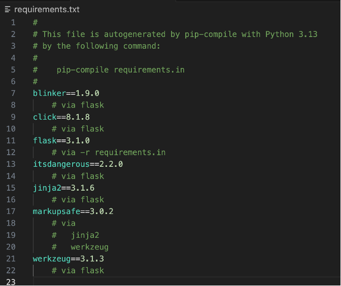

# Lernjournal 1 Python

## Repository und Library

| | Bitte ausfüllen |
| -------- | ------- |
| Repository (URL)  |
| Kurze Beschreibung der App-Funktion | Diese Webanwendung wurde mit Flask entwickelt. Nutzer können einen beliebigen Text eingeben, der vom Backend umgekehrt wird. Die umgekehrte Version wird direkt im Browser angezeigt.  |
| Verwendete Library aus PyPi (Name) | Flask, Werkzeug, Jinja2, MarkupSafe, Click, Blinker, Itsdangerous |
| Verwendete Library aus PyPi (URL) | 
[Flask](https://pypi.org/project/Flask/)  
[Werkzeug](https://pypi.org/project/Werkzeug/)  
[Jinja2](https://pypi.org/project/Jinja2/)  
[MarkupSafe](https://pypi.org/project/MarkupSafe/)  
[Click](https://pypi.org/project/click/)  
[Blinker](https://pypi.org/project/blinker/)  
[Itsdangerous](https://pypi.org/project/itsdangerous/) ||


## App, Funktionalität

Diese Anwendung ist eine einfache Flask-Webanwendung, die es Nutzern ermöglicht, eingegebenen Text umzukehren und das Ergebnis direkt im Browser anzuzeigen.

### Funktionsweise:
- Nutzer geben einen Text ein und klicken auf „Umkehren“.
- Die Eingabe wird an das Flask-Backend übermittelt.
- Der Text wird dort verarbeitet (umgekehrt) und über das Template wieder ausgegeben.

### Technische Umsetzung:
- **Backend:** Flask verarbeitet GET- und POST-Anfragen.
- **Frontend:** HTML & Bootstrap (kein JavaScript-Framework).
- **Verarbeitung:** erfolgt vollständig im Python-Backend (`[::-1]`).

### Besonderheiten:
- Intuitive und einfache Benutzeroberfläche
- Verarbeitung erfolgt vollständig im Backend
- Ergebnisanzeige über Template (Jinja2)
- Nur eine Route (`/`) nötig
- Kein Einsatz von Frontend-Libraries 
- Screenshots dokumentieren den Ablauf im Ordner `images/`

---

## Dependency Management

Die Abhängigkeiten wurden mit einer **virtuellen Umgebung (`venv`)** verwaltet, um sicherzustellen, dass keine globalen Pakete das Projekt beeinflussen.

### Schritte:
1. Erstellung & Aktivierung des virtuellen Environments (`python -m venv venv`)
2. Installation von Flask: `pip install flask`
3. Verwendung von `requirements.in` zur Verwaltung der Basis-Abhängigkeiten
4. Generierung von `requirements.txt` mit `pip-compile` (aus `pip-tools`)
5. Installation aller Abhängigkeiten mit: `pip install -r requirements.txt`


  
**Abb. 1:** Generierte `requirements.txt` nach `pip-compile`

  
**Abb. 2:** Terminal-Ausgabe beim Erstellen der `requirements.txt`

Alle Packages wurden mit festen Versionen definiert, um reproduzierbare Installationen auf jedem System sicherzustellen.

---

## Deployment

### Lokaler Test:
- Die App wurde erfolgreich lokal gestartet (`python app.py`)
- Verfügbar unter: `http://127.0.0.1:5000`
- Funktionalität wurde vollständig getestet

  
**Abb. 3:** Lokale Ausführung der App auf `http://127.0.0.1:5000`

  
**Abb. 4a:** Texteingabe "hallo" vor Absenden

  
**Abb. 4b:** Ausgabe "ollah" nach Verarbeitung im Backend


### Deployment auf Microsoft Azure:
- Login über Azure CLI (`az login`)

- Erstellung einer **Resource Group**:  
  Name: `sivanujan-selvarajah`, Region: `switzerlandnorth`
- ZIP-Deployment via:
  ```bash
  az webapp up --name meine-app --resource-group sivanujan-selvarajah --plan sivanujan-selvarajah

  	•	App-Service wurde automatisch erstellt (Plan: F1 / kostenlos)
	•	Bereitstellung über Python 3.10, gestartet mit Gunicorn-WSGI
	•	Live-Link zur App: https://meine-app.azurewebsites.net

  
**Abb. 5:** Übersicht über Azure-Subscription nach erfolgreichem Login

  
**Abb. 6:** Erstellung der Azure Resource Group `sivanujan-selvarajah` in der Region `switzerlandnorth`

  
**Abb. 7:** Bereitstellung der Web-App über Azure CLI mit dem Befehl `az webapp up`

  
**Abb. 8a:** Geöffnete Azure-App im Browser vor Eingabe eines Texts

  
**Abb. 8b:** Erfolgreiche Texteingabe und Ausgabe auf der Azure-App

Alle Screenshots vom Deployment-Prozess (lokal & Azure) sind im Ordner images/ abgelegt und belegen den erfolgreichen Ablauf.


### Dokumentation von Code und Repository

#### Code

- Die Hauptlogik liegt in `app.py`
- Es wird nur eine Route (`/`) verwendet, die sowohl `GET`- als auch `POST`-Anfragen verarbeitet
- Die Texteingabe wird im Backend mit `[::-1]` umgekehrt
- Das Ergebnis wird per `render_template()` an das HTML-Template `templates/index.html` übergeben


# app.py – erstellt von selvasiv
# Diese App kehrt Texte um und zeigt das Ergebnis über HTML an

from flask import Flask, render_template, request

app = Flask(__name__)

# Flask-Route für die Hauptseite
# Wenn Methode POST: Text aus dem Formular holen, umkehren und anzeigen
# Wenn Methode GET: leere Seite anzeigen
@app.route("/", methods=["GET", "POST"])
def index():
    reversed_text = ""  # Ausgabevariable initialisieren
    if request.method == "POST":
        user_text = request.form.get("user_text", "")  # Texteingabe aus dem Formular holen
        reversed_text = user_text[::-1]  # Text im Backend umkehren
    return render_template("index.html", reversed_text=reversed_text)  # Ergebnis im Template anzeigen

if __name__ == "__main__":
    app.run(debug=True)  # Lokaler Entwicklungsmodus


#### Repository-Struktur

    projektordner/
├── app.py
├── requirements.in
├── requirements.txt
├── templates/
│   └── index.html
├── images/
│   └── [Screenshots]
└── lernjournal.md (oder Word)

## Reflexion

Im ersten Lernjournal konnte ich meine Python-Kenntnisse auffrischen und gezielt in einem praktischen Projekt einsetzen. Die Arbeit mit Flask hat mir geholfen, den Ablauf einer einfachen Webanwendung besser zu verstehen – von der Routenstruktur über die Verarbeitung im Backend bis zur Darstellung im Frontend.

Besonders spannend war für mich der Teil, bei dem ich die App über Azure Web App deployt habe. Dadurch habe ich nicht nur gelernt, wie man eine App mit der Azure CLI bereitstellt, sondern auch, worauf es bei der Vorbereitung des Codes und der Abhängigkeiten (z. B. `requirements.txt`) ankommt.

Die Kombination aus HTML, Bootstrap und Flask war ideal für den Einstieg, und ich konnte mit einem einfachen Use Case (Texteingabe und Umkehrung) ein vollständiges Web-App-Projekt realisieren – inklusive Cloud Deployment. Insgesamt war es eine lehrreiche und praxisnahe Erfahrung.

