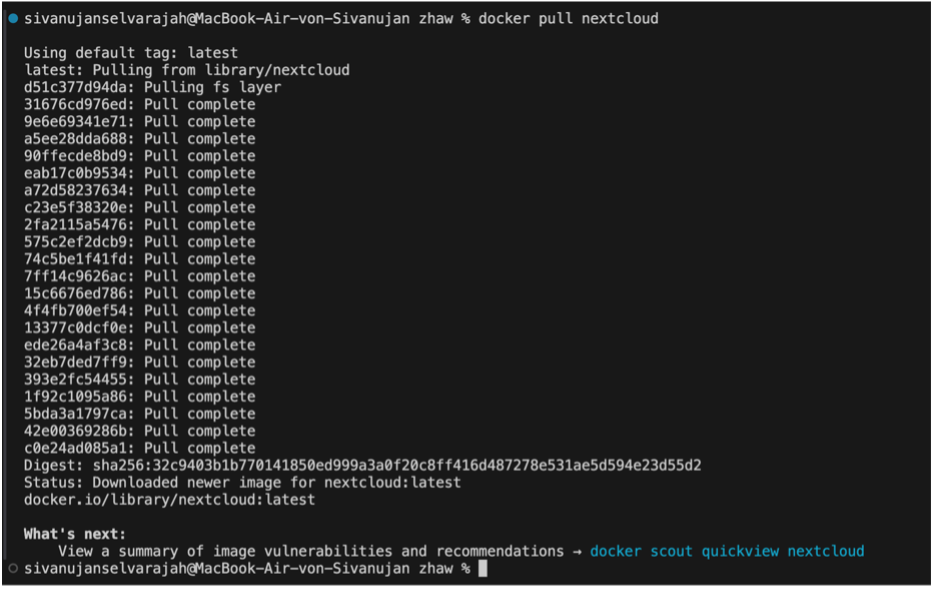
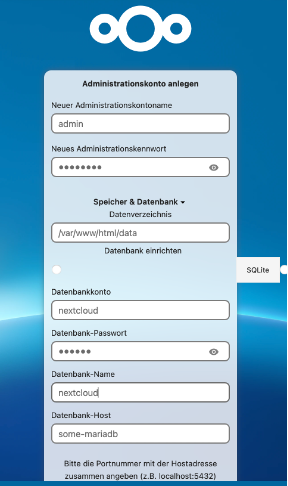
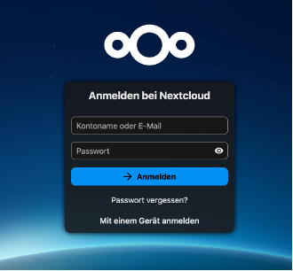
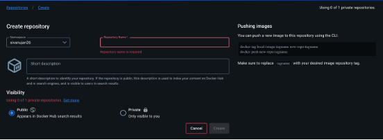

# Lernjournal 2 Container

## Docker Web-Applikation

### Verwendete Docker Images

| | Bitte ausfüllen |
| -------- | ------- |
| Image 1 | nextcloud |
| Image 1 | [https://hub.docker.com/_/nextcloud](https://hub.docker.com/_/nextcloud) |
| Image 2 | mariadb |
| Image 2 | [https://hub.docker.com/_/mariadb](https://hub.docker.com/_/mariadb)  |
| ... | ... |
| Docker Compose | URL Github Repo |

### Dokumentation manuelles Deployment

- Docker Images `nextcloud` (**Abb. 1**) und `mariadb` (**Abb. 2**) wurden einzeln mit `docker pull` heruntergeladen
- Netzwerk erstellt: `docker network create nextcloud-net` (**Abb. 3**)
- Datenbank-Container gestartet:
  ```bash
  docker run -d --name mariadb --network nextcloud-net \
    -e MYSQL_ROOT_PASSWORD=secret \
    -e MYSQL_PASSWORD=nextcloud \
    -e MYSQL_DATABASE=nextcloud \
    -e MYSQL_USER=nextcloud \
    mariadb

- Danach Nextcloud-Container gestartet:

  ```bash
  docker run -d --name nextcloud --network nextcloud-net \
    -p 8080:80 nextcloud

- Im Browser erreichbar unter: `http://localhost:8080` (**Abb. 4**)
- Setup durch Web-UI abgeschlossen (Admin-User, Datenbankverbindung) (**Abb. 5**)
- Beide Container waren aktiv und sichtbar im Docker Dashboard (**Abb. 6**) und über `docker ps` (**Abb. 7**)

Im ersten Schritt habe ich eine klassische Docker-Web-Applikation bestehend aus Nextcloud und MariaDB manuell deployed. Ziel war es, die Container selbstständig zu starten, zu vernetzen und über den Browser erreichbar zu machen.

### 📸 Screenshots – Manuelles Deployment (Nextcloud + MariaDB)

  
**Abb. 1:** Docker Pull für das Nextcloud-Image

  
**Abb. 2:** Startbefehl für MariaDB mit Umgebungsvariablen

  
**Abb. 3:** Erstellen eines Docker-Netzwerks und Verbinden beider Container

  
**Abb. 4:** Web-basierte Einrichtung von Nextcloud

  
**Abb. 5:** Übersicht laufender Container: Nextcloud & MariaDB

  
**Abb. 6:** Login-Bildschirm von Nextcloud nach erfolgreichem Setup

  
**Abb. 7:** Ausgabe von `docker ps` mit Containerstatus und Port-Mapping


### Dokumentation Docker-Compose Deployment

- `docker-compose.yml` erstellt mit den Diensten `db` und `app`
- Volumes zur Datenpersistenz definiert
- Kommandos:
  ```bash
  docker-compose up -d


- Funktionierte identisch wie manuelles Deployment
- Web-Oberfläche über `http://localhost:8080` geöffnet (**Abb. 4**)
- Screenshots vom Container-Start und Web-App im Browser vorhanden (**Abb. 6**, **Abb. 7**)

Anschließend habe ich das Setup mithilfe von Docker Compose automatisiert. Dies ermöglichte ein einfaches Starten beider Container mit einem Befehl und eine strukturierte Konfiguration über eine YAML-Datei.


## Deployment ML-App

### Variante und Repository

| Gewähltes Beispiel | Bitte ausfüllen |
| -------- | ------- |
| onnx-sentiment-analysis | Nein |
| onnx-image-classification | Ja |
| Repo URL Fork | https://github.com/sivanujan-selvarajah/onnx-image-classification |
| Docker Hub URL | https://hub.docker.com/repository/docker/sivanujan26/onnx-image-classification/general |

### Dokumentation lokales Deployment

- Image lokal mit Dockerfile gebaut (**Abb. 8**):
  ```bash
  docker build -t sivanujan/onnx-image-classification .

- Container gestartet (**Abb. 9**):
  ```bash
  docker run --name onnx-image-classification -p 9000:5000 -d sivanujan/onnx-image-classification 

  - Web-App erfolgreich unter `http://localhost:5000` geöffnet
- Screenshot mit geöffneter App im Browser gemacht (**Abb. 9**)


### 📸 Screenshots – ONNX Image Classification

  
**Abb. 8:** Build-Prozess der ONNX Image Classification App mit Dockerfile

  
**Abb. 9:** Starten der ONNX-App lokal auf Port 5000

### Dokumentation Push nach Docker Hub

- Nach erfolgreichem lokalen Test wurde ein Repository bei Docker Hub erstellt (**Abb. 9a**).
- Das Repository trägt den Namen `sivanujan26/onnx-image-classification`.
- Das lokal gebaute Image wurde mit folgendem Befehl hochgeladen:
  ```bash
  docker push sivanujan26/onnx-image-classification:latest

- Der Upload umfasst mehrere Layer, wovon viele aus dem Python-Basisimage wiederverwendet wurden.
- Das Image ist nun öffentlich auf Docker Hub verfügbar und kann mit folgendem Befehl gezogen werden:
  ```bash
  docker pull sivanujan26/onnx-image-classification:latest

  Nach erfolgreichem Testen des lokal gebauten Images habe ich ein öffentliches Repository auf Docker Hub erstellt und das Image hochgeladen. So war es für spätere Deployments über Azure bereit.

  
### 📸 Screenshots – Dokumentation Push nach Docker Hub




### Dokumentation Deployment Azure Web App

* [ ] TODO

### Dokumentation Deployment ACA

* [ ] TODO

### Dokumentation Deployment ACI

* [ ] TODO