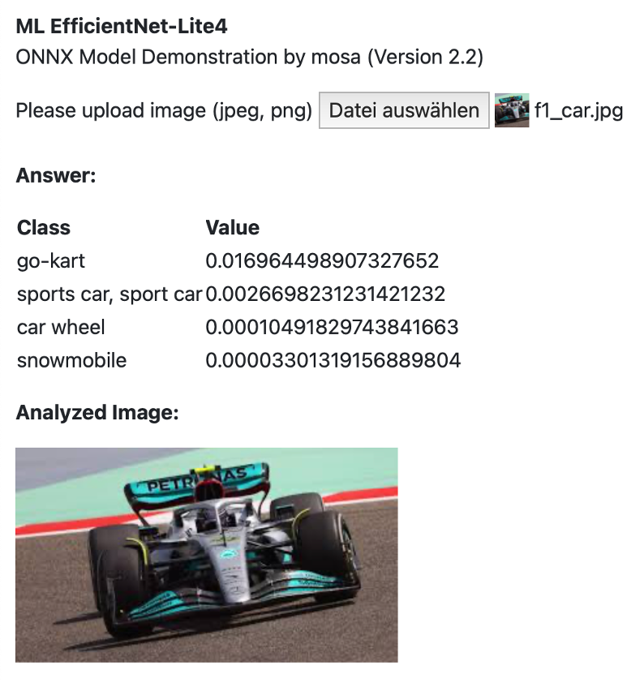

# Lernjournal 3 ONNX

## Übersicht

| | Bitte ausfüllen |
| -------- | ------- |
| bertsquad-10.onnx | https://github.com/sivanujan-selvarajah/models/blob/main/validated/text/machine_comprehension/bert-squad/model/bertsquad-10.onnx |
| onnx-image-classification Fork (EfficientNet-Lite) | https://github.com/sivanujan-selvarajah/onnx-image-classification |

## Inhaltsverzeichnis

  - [Dokumentation ONNX Analyse](#dokumentation-onnx-analyse)
    - [Beobachtete Operatoren im Modell](#beobachtete-operatoren-im-modell)
    - [Interpretation](#interpretation)
    - [Screenshot aus Netron](#screenshot-aus-netron)
  - [Dokumentation onnx-image-classification](#dokumentation-onnx-image-classification)
    - [Ausgangslage](#ausgangslage)
    - [Austausch des Modells](#austausch-des-modells)
    - [Lokale Inferenz und Vergleich](#lokale-inferenz-und-vergleich)
    - [Ergebnisvergleich](#ergebnisvergleich)
    - [Beobachtungen](#beobachtungen)
    - [Screenshots](#screenshots)
  - [Reflexion](#reflexion)
  - [Quellenverzeichnis](#quellenverzeichnis)

## Dokumentation ONNX Analyse

Für die ONNX-Analyse habe ich das Modell bertsquad-10.onnx aus dem ONNX Model Zoo verwendet. Mithilfe von Netron, einem grafischen Viewer für ONNX-Modelle, konnte ich die Modellstruktur visuell analysieren. Netron stellt alle Operatoren und deren Verbindungen dar, was vor allem bei komplexen Netzwerken hilfreich ist.

### Beobachtete Operatoren im Modell:
- `Unsqueeze` – mehrere Stellen im Graph, zum Erweitern der Dimensionen
- `Cast` – Datentyp-Konvertierung (z. B. Int → Float)
- `Slice` – schneidet Tensoren entlang bestimmter Achsen
- `Concat` – Zusammenfügen mehrerer Tensoren
- `Reshape` – ändert die Form von Tensoren (z. B. zur Anpassung vor Layers)
- `Squeeze` – entfernt Dimensionsachsen mit Länge 1
- `ConstantOfShape`, `Mul` – für statische Formgebung und Tensor-Multiplikation

### Interpretation

Im oberen Teil des Modells werden verstärkt Operatoren wie `Slice`, `Unsqueeze` und `Cast` eingesetzt. Diese deuten auf eine umfangreiche Vorverarbeitung der Eingabedaten hin – beispielsweise zur Erzeugung von Masken oder zur Anpassung der Sequenzdimensionen. 

Besonders auffällig ist die wiederkehrende Kombination `Unsqueeze → Concat → Reshape`, die eine flexible Neustrukturierung der Tensorformen nahelegt. 

Solche Operatorfolgen sind typisch für NLP-Modelle wie BERT, bei denen Texte in strukturierte, modellgerechte Sequenzen transformiert werden müssen.

Die Analyse mit Netron hat mir geholfen zu verstehen, wie umfangreich die Vorverarbeitung bei Transformer-Modellen aufgebaut ist – insbesondere, wie stark Operatoren wie Reshape und Slice dabei verwendet werden, um Eingabedaten modellgerecht umzuwandeln.

### Screenshot aus Netron

  
**Abb. 1:** Analyse eines Ausschnitts des Modells `bertsquad-10.onnx` in Netron – mit Fokus auf `Unsqueeze`, `Concat`, `Cast` und `Reshape`.

## Dokumentation onnx-image-classification

### Ausgangslage

Als Basis diente das ONNX-Beispielprojekt `onnx-image-classification`, das mit dem Modell `EfficientNet-Lite4` arbeitet. Die Anwendung basiert auf Flask und erlaubt es, ein Bild hochzuladen und die Klassifikationsergebnisse als Top-5-Ausgabe im Browser darzustellen.

---

### Austausch des Modells

Der Austausch des Modells erfolgte manuell: Ich habe die Originaldatei efficientnet-lite4-11.onnx im Projektordner durch die quantisierte Version efficientnet-lite4-11-qdq.onnx ersetzt. Da die Struktur des Modells identisch blieb, war keine Anpassung im Code notwendig.

Die Abkürzung “qdq” steht für Quantize–Dequantize, ein gängiges Muster zur Optimierung von ONNX-Modellen für ressourcenschwache Geräte.

---

### Lokale Inferenz und Vergleich

Beide Modelle wurden lokal über `python app.py` ausgeführt. Dabei wurden **drei verschiedene Bilder** analysiert, um die Klassifikationsergebnisse und Wahrscheinlichkeiten zu vergleichen.

Obwohl die genauen Wahrscheinlichkeiten leicht abwichen, zeigten beide Modelle **konsistente Top-1- und Top-5-Ergebnisse**. Dies bestätigt, dass auch das quantisierte Modell (qdq) bei verschiedenen Eingaben zuverlässig arbeitet – trotz geringfügig reduzierter numerischer Präzision.

---

### Ergebnisvergleich

Trotz identischer Top-5-Kategorien unterscheiden sich die Wahrscheinlichkeitswerte leicht zwischen den beiden Modellen.

Diese Unterschiede in den Wahrscheinlichkeiten entstehen durch die reduzierte numerische Präzision, die bei quantisierten Modellen eingesetzt wird. Statt 32-Bit-Floating-Point-Werten verwenden quantisierte Modelle typischerweise 8-Bit-Werte, was kleinere Rundungsfehler verursachen kann.

Trotz dieser leichten Abweichungen bleibt die Klassifikation stabil und ausreichend genau, sodass die kleinere Modellvariante sehr gut für ressourcenarme Geräte wie Smartphones oder Edge-Devices geeignet ist.

---

### Beobachtungen:

Das Modell mit Quantisierung (`qdq`) ist deutlich kleiner (nur ~12 MB) und somit besser für Embedded- oder Edge-Szenarien geeignet. Gleichzeitig sinkt die Top-1-Genauigkeit nur minimal (von 80.4 % auf 76.9 %), was für viele praktische Anwendungsfälle akzeptabel bleibt. 

Der Modelltausch zeigt, dass quantisierte Modelle trotz kleiner Genauigkeitsverluste erhebliche Vorteile hinsichtlich Speicherbedarf und Effizienz bieten. Besonders in ressourcenbeschränkten Umgebungen wie mobilen Geräten oder Edge-Deployments ist diese Optimierung sehr wertvoll, da sie geringere Ladezeiten und niedrigere Hardwareanforderungen ermöglicht.

Der Inference-Pfad im Code musste nicht angepasst werden, was die Flexibilität von ONNX-Modellen zusätzlich unterstreicht.

### Screenshots

  
**Abb. 2:** Start der Flask-Anwendung lokal via `python app.py`

  
**Abb. 3:** Ergebnis der Bildklassifikation mit dem Originalmodell `EfficientNet-Lite4`.

  
**Abb. 4:** Analyse des gleichen Bildes mit dem kleineren Modell `EfficientNet-Lite4-qdq`. Geringfügig andere Wahrscheinlichkeitswerte.

  
**Abb. 5:** Übersicht der Modelle aus dem ONNX Model Zoo mit Downloadgröße und Top-1-Accuracy.

## Reflexion

Durch die Arbeit an diesem Lernjournal konnte ich mein Verständnis für ONNX-Modelle deutlich vertiefen. Besonders der Einsatz von Netron half mir, die Struktur und die typischen Operatorfolgen in NLP-Modellen wie BERT besser nachzuvollziehen.

Der Austausch und die Analyse verschiedener Modelle zeigten mir, wie einfach ONNX-Modelle durch modularen Aufbau ersetzt werden können – ohne zusätzlichen Anpassungsaufwand im Code. Gleichzeitig konnte ich die Auswirkungen von Modellquantisierung besser einschätzen und verstehen, wie Optimierungen für ressourcenarme Systeme praktisch umgesetzt werden.

Insgesamt habe ich durch diese Übungen ein besseres technisches Verständnis für Machine-Learning-Modelle, Deployment und Performance-Optimierung entwickelt, das mir auch bei zukünftigen Projekten von Nutzen sein wird.

## Quellenverzeichnis

- [ONNX Model Zoo](https://github.com/onnx/models)
- [Netron Viewer](https://netron.app/)
- [ONNX Dokumentation](https://onnx.ai/)
- [GitHub Repo – onnx-image-classification](https://github.com/sivanujan-selvarajah/onnx-image-classification)