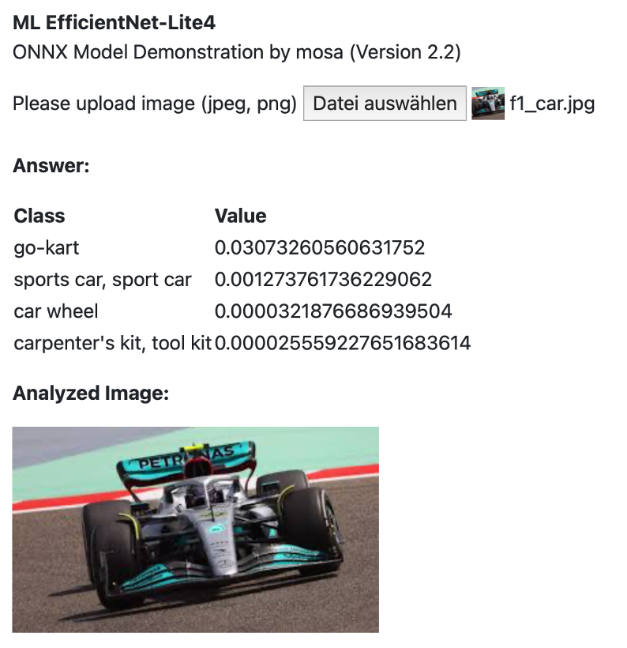

# Lernjournal 3 ONNX

## Übersicht

| | Bitte ausfüllen |
| -------- | ------- |
| bertsquad-10.onnx | https://github.com/sivanujan-selvarajah/models/blob/main/validated/text/machine_comprehension/bert-squad/model/bertsquad-10.onnx |
| onnx-image-classification Fork (EfficientNet-Lite) | URL |

## Dokumentation ONNX Analyse

Für die ONNX-Analyse habe ich das Modell **`bertsquad-10.onnx`** aus dem [ONNX Model Zoo](https://github.com/onnx/models/tree/main/text/machine_comprehension/bert-squad) verwendet. Das Modell wurde mithilfe von **Netron** geöffnet und analysiert.

### 🔎 Beobachtete Operatoren im Modell:
- `Unsqueeze` – mehrere Stellen im Graph, zum Erweitern der Dimensionen
- `Cast` – Datentyp-Konvertierung (z. B. Int → Float)
- `Slice` – schneidet Tensoren entlang bestimmter Achsen
- `Concat` – Zusammenfügen mehrerer Tensoren
- `Reshape` – ändert die Form von Tensoren (z. B. zur Anpassung vor Layers)
- `Squeeze` – entfernt Dimensionsachsen mit Länge 1
- `ConstantOfShape`, `Mul` – für statische Formgebung und Tensor-Multiplikation

### 💬 Interpretation

Im oberen Teil des Modells werden verstärkt Operatoren wie `Slice`, `Unsqueeze` und `Cast` eingesetzt. Diese deuten auf eine umfangreiche Vorverarbeitung der Eingabedaten hin – beispielsweise zur Erzeugung von Masken oder zur Anpassung der Sequenzdimensionen. 

Besonders auffällig ist die wiederkehrende Kombination `Unsqueeze → Concat → Reshape`, die eine flexible Neustrukturierung der Tensorformen nahelegt. 

Solche Operatorfolgen sind typisch für NLP-Modelle wie BERT, bei denen Texte in strukturierte, modellgerechte Sequenzen transformiert werden müssen.

### 📸 Screenshot aus Netron

  
**Abb. 1:** Analyse eines Ausschnitts des Modells `bertsquad-10.onnx` in Netron – mit Fokus auf `Unsqueeze`, `Concat`, `Cast` und `Reshape`.

## Dokumentation onnx-image-classification

### 🧪 Ausgangslage

Als Basis diente das ONNX-Beispielprojekt `onnx-image-classification`, das mit dem Modell `EfficientNet-Lite4` arbeitet. Die Anwendung basiert auf Flask und erlaubt es, ein Bild hochzuladen und die Klassifikationsergebnisse als Top-5-Ausgabe im Browser darzustellen.

---

### 🔁 Austausch des Modells

Für den Vergleich wurde das Standardmodell `efficientnet-lite4-11.onnx` durch die kleinere Variante `efficientnet-lite4-11-qdq.onnx` ersetzt (Quantisierung und Optimierung für Edge-Einsatz).  
Es wurde **kein Code angepasst**, da Modellname und Struktur erhalten blieben – nur das `.onnx`-File wurde ersetzt.

---

### 🔍 Lokale Inferenz und Vergleich

Beide Modelle wurden lokal über `python app.py` ausgeführt. Dabei wurde dasselbe Bild analysiert, um die Klassifikationsergebnisse und Wahrscheinlichkeiten zu vergleichen.

---

### 📊 Ergebnisvergleich

Trotz identischer Top-5-Kategorien unterscheiden sich die **Wahrscheinlichkeitswerte leicht**. Dies zeigt, dass die kleinere Modellvariante eine etwas andere Gewichtung in der Ausgabe erzeugt – typisch bei quantisierten ONNX-Modellen.

---

### 📌 Beobachtungen:

- Das Modell mit Quantisierung (`qdq`) ist **deutlich kleiner** (nur ~12 MB) und somit besser für Embedded/Edge-Szenarien geeignet.
- Die **Genauigkeit (Top-1)** sinkt nur minimal (von 80.4% auf 76.9%), was für viele Anwendungsfälle akzeptabel ist.
- Der **Inference-Pfad** im Code musste **nicht angepasst** werden – das ONNX-Format macht den Austausch sehr einfach.

### 📸 Screenshots

  
**Abb. 1:** Start der Flask-Anwendung lokal via `python app.py`

  
**Abb. 2:** Ergebnis der Bildklassifikation mit dem Originalmodell `EfficientNet-Lite4`.

  
**Abb. 3:** Analyse des gleichen Bildes mit dem kleineren Modell `EfficientNet-Lite4-qdq`. Geringfügig andere Wahrscheinlichkeitswerte.

  
**Abb. 4:** Übersicht der Modelle aus dem ONNX Model Zoo mit Downloadgröße und Top-1-Accuracy.