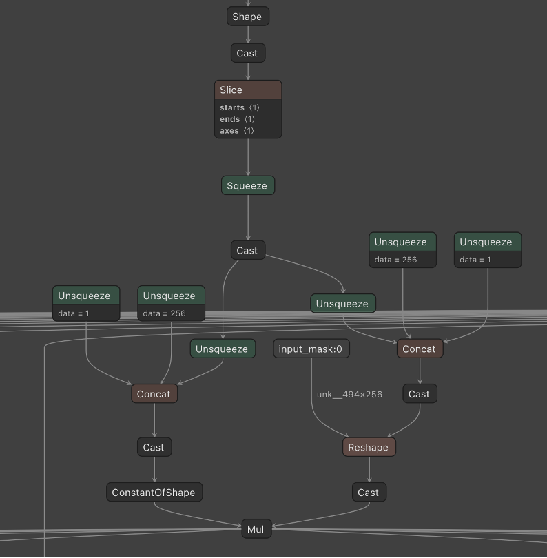

# Lernjournal 3 ONNX

## Übersicht

| | Bitte ausfüllen |
| -------- | ------- |
| bertsquad-10.onnx | https://github.com/sivanujan-selvarajah/models/blob/main/validated/text/machine_comprehension/bert-squad/model/bertsquad-10.onnx |
| onnx-image-classification Fork (EfficientNet-Lite) | URL |

## Dokumentation ONNX Analyse

Für die ONNX-Analyse habe ich das Modell **`bertsquad-10.onnx`** aus dem [ONNX Model Zoo](https://github.com/onnx/models/tree/main/text/machine_comprehension/bert-squad) verwendet. Das Modell wurde mithilfe von **Netron** geöffnet und analysiert.

### 🔎 Beobachtete Operatoren im Modell:
- `Unsqueeze` – mehrere Stellen im Graph, zum Erweitern der Dimensionen
- `Cast` – Datentyp-Konvertierung (z. B. Int → Float)
- `Slice` – schneidet Tensoren entlang bestimmter Achsen
- `Concat` – Zusammenfügen mehrerer Tensoren
- `Reshape` – ändert die Form von Tensoren (z. B. zur Anpassung vor Layers)
- `Squeeze` – entfernt Dimensionsachsen mit Länge 1
- `ConstantOfShape`, `Mul` – für statische Formgebung und Tensor-Multiplikation

### 💬 Interpretation

Im oberen Teil des Modells werden verstärkt Operatoren wie `Slice`, `Unsqueeze` und `Cast` eingesetzt. Diese deuten auf eine umfangreiche Vorverarbeitung der Eingabedaten hin – beispielsweise zur Erzeugung von Masken oder zur Anpassung der Sequenzdimensionen. 

Besonders auffällig ist die wiederkehrende Kombination `Unsqueeze → Concat → Reshape`, die eine flexible Neustrukturierung der Tensorformen nahelegt. 

Solche Operatorfolgen sind typisch für NLP-Modelle wie BERT, bei denen Texte in strukturierte, modellgerechte Sequenzen transformiert werden müssen.

### 📸 Screenshot aus Netron

  
**Abb. 1:** Analyse eines Ausschnitts des Modells `bertsquad-10.onnx` in Netron – mit Fokus auf `Unsqueeze`, `Concat`, `Cast` und `Reshape`.

## Dokumentation onnx-image-classification

* [ ] TODO