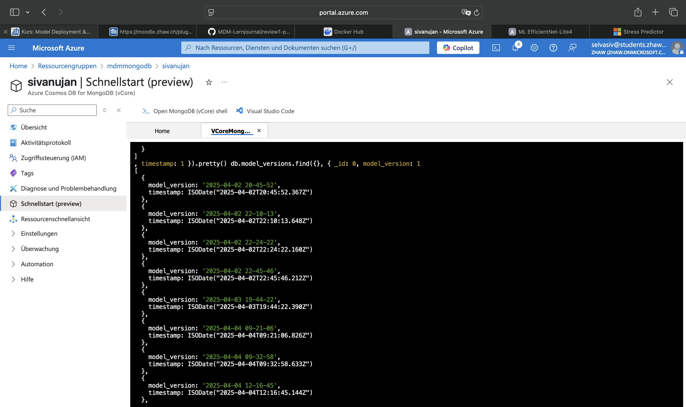
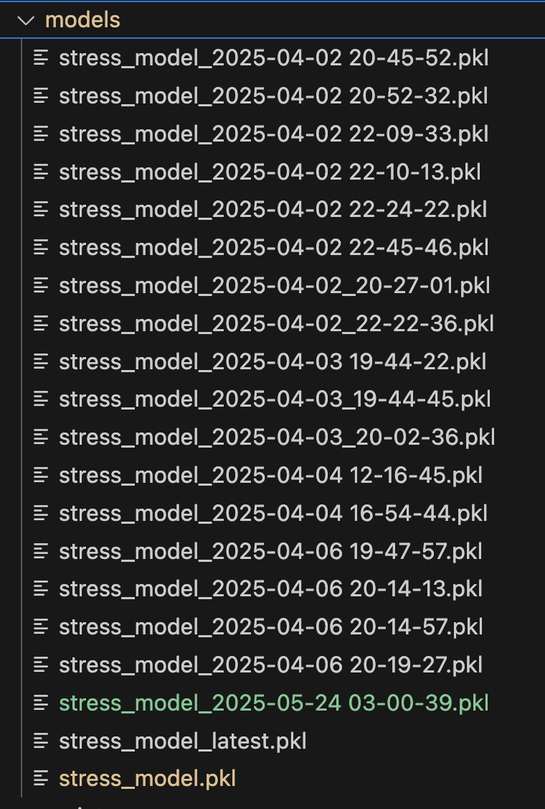
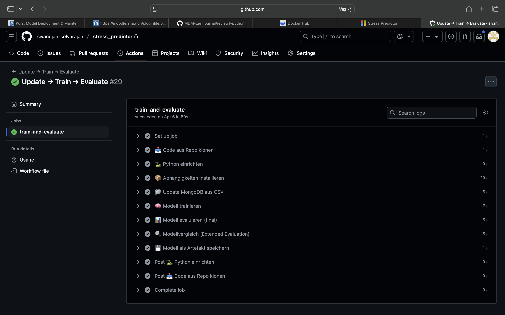
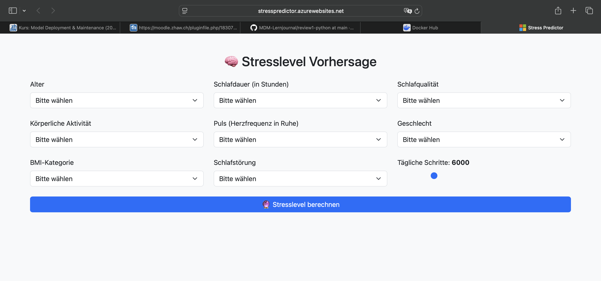
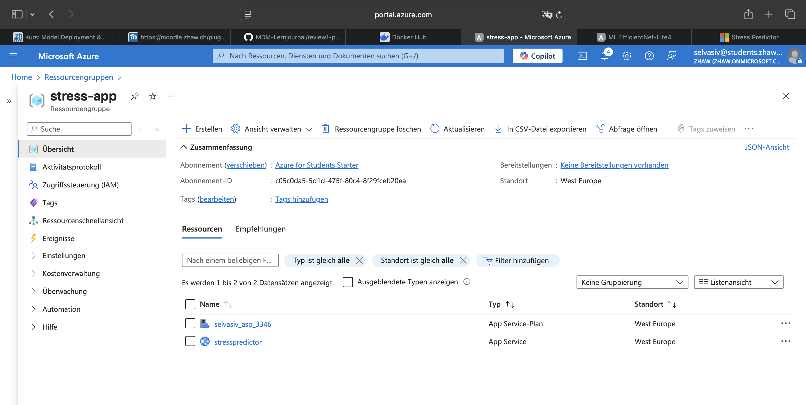

# Projekt 1 Python

## Übersicht

| | Bitte ausfüllen |
| -------- | ------- |
| Variante | Eigenes Projekt|
| Datenherkunft | CSV Lifestyle- und Schlafdaten mit Attributen wie Alter, Geschlecht, Schlafdauer, Schlafqualität, tägliche Schritte und Schlafstörungen.|
| Datenherkunft | [Kaggle Dataset](https://www.kaggle.com/datasets/uom190346a/sleep-health-and-lifestyle-dataset?utm_source=chatgpt.com) |
| ML-Algorithmus | Gradient Boosting Regressor |
| Repo URL | [GitHub – stress_predictor](https://github.com/sivanujan-selvarajah/stress_predictor) |

## 📑 Inhaltsverzeichnis

  - [Dokumentation](#dokumentation)
    - [Projekteinleitung](#projekteinleitung)
    - [Data Scraping](#data-scraping)
      - [Data Collection & Ingestion](#data-collection--ingestion)
      - [Automatisierte Datenaktualisierung (GitHub Actions → MongoDB)](#automatisierte-datenaktualisierung-github-actions--mongodb)
      - [Genutzter Codeausschnitt (update.py)](#genutzter-codeausschnitt-updatepy)
      - [Data Cleaning](#data-cleaning)
      - [Wichtige Schritte](#wichtige-schritte)
      - [Beispiel-Code](#beispiel-code)
    - [Training](#training)
      - [Trainingsprozess](#trainingsprozess)
      - [Trainings-Code](#trainings-code)
      - [ModelOps](#modelops)
      - [Model Evaluation](#model-evaluation)
      - [Bewertete Metriken](#bewertete-metriken)
      - [Vorgehen](#vorgehen)
      - [Evaluations-Code](#evaluations-code)
      - [Modellvergleich](#modellvergleich)
      - [Vorgehen](#vorgehen-1)
      - [Bewertungs-Code](#bewertungs-code)
      - [Interpretation](#interpretation)
    - [ModelOps Automation](#modelops-automation)
      - [Ablauf der ModelOps Automation](#ablauf-der-modelops-automation)
      - [Besonderheiten der ModelOps Strategie](#besonderheiten-der-modelops-strategie)
      - [GitHub Actions](#github-actions)
      - [Ablauf der Automatisierung](#ablauf-der-automatisierung)
      - [Vorteile des Ansatzes](#vorteile-des-ansatzes)
    - [Deployment](#deployment)
      - [Aufbau der Web-Applikation](#aufbau-der-web-applikation)
      - [Lokaler Test](#lokaler-test)
      - [Deployment als Azure Web App](#deployment-als-azure-web-app)
      - [Learnings & Herausforderungen](#learnings--herausforderungen)
    - [Reflexion](#reflexion)
    - [Quellenverzeichnis](#quellenverzeichnis)

## Dokumentation

### Projekteinleitung

In diesem Projekt wurde ein Machine Learning Modell entwickelt, um den **Stress-Level von Personen** auf Basis von Lifestyle- und Schlafgewohnheiten vorherzusagen.  
Das Ziel war es, aus leicht verfügbaren Alltagsdaten wie Schlafdauer, Schlafqualität, täglicher Aktivität und dem allgemeinen Gesundheitszustand eine Einschätzung über das persönliche Stresslevel zu ermöglichen.

Ursprünglich war vorgesehen, einen eigenen Datensatz durch Web Scraping zu erstellen.  
Aufgrund technischer Herausforderungen wurde dieser Ansatz verworfen, und es wurde stattdessen auf einen hochwertigen öffentlichen Datensatz von Kaggle zurückgegriffen.

Die Projektumsetzung umfasste folgende Hauptschritte:

- Sammlung und automatisierte Aktualisierung der Daten
- Aufbereitung und Bereinigung der Daten
- Modelltraining mit Gradient Boosting Regressor
- Evaluierung der Modellergebnisse und Vergleich mit einem Basismodell (Linear Regression)
- Automatisierte Modellversionierung und Absicherung mittels MongoDB
- Aufbau eines GitHub Actions Workflows zur vollständigen CI/CD-Automatisierung

**Technische Besonderheit:**  
Obwohl das vollständige Deployment als Webservice geplant war, wurde dies aufgrund von technischen Einschränkungen im Projektrahmen nicht umgesetzt. Der Fokus lag stattdessen auf einer stabilen, automatisierten Modellentwicklung und -verwaltung.

Damit ist das Projekt eine vollständige Fallstudie für einen modernen, automatisierten Machine Learning Workflow – von der Datenaufnahme bis zur abgesicherten Modellbereitstellung.

### Data Scraping

#### Data Collection & Ingestion

Ursprünglich war geplant, einen eigenen Datensatz durch Web Scraping zu erstellen. Aufgrund technischer Herausforderungen und unzureichender Datenqualität aus verfügbaren Quellen wurde entschieden, stattdessen auf einen qualitativ hochwertigen, öffentlich verfügbaren Datensatz zurückzugreifen.
Verwendet wurde der [Sleep Health and Lifestyle Dataset](https://www.kaggle.com/datasets/uom190346a/sleep-health-and-lifestyle-dataset) von Kaggle.
Der Datensatz wurde manuell als CSV-Datei heruntergeladen und in das Projektverzeichnis unter `data/Sleep_health_and_lifestyle_dataset.csv` gespeichert. Zusätzlich wurde die Datei ins GitHub-Repository hochgeladen, um sie im Rahmen einer GitHub Actions Pipeline automatisiert zu verarbeiten.
Damit wurde sichergestellt, dass der Datensatz konsistent bereitsteht und bei jedem Update automatisch in die angebundene MongoDB importiert wird.


#### Automatisierte Datenaktualisierung (GitHub Actions → MongoDB)

Über eine GitHub Actions Workflow wird bei jedem Push in das Repository der Datensatz automatisch aktualisiert:

- Die bestehende Sammlung `original_data` in MongoDB wird vollständig geleert (`delete_many({})`).
- Die aktuelle CSV wird neu eingelesen (`pandas.read_csv`).
- Jeder Eintrag erhält einen Zeitstempel (`imported_at`).
- Alle neuen Datensätze werden in die MongoDB geschrieben (`insert_many`).

Somit ist sichergestellt, dass bei jeder Aktualisierung stets der aktuellste und konsistente Datenstand verfügbar ist.

  
**Abb. 1:** Ausführung von `update.py` zur automatisierten Datenaktualisierung in MongoDB

  
**Abb. 2:** Erfolgreich importierte Daten aus der `original_data` Collection

#### Genutzter Codeausschnitt (update.py):

```python
from pymongo import MongoClient
from dotenv import load_dotenv
import pandas as pd
from datetime import datetime
import os

# Verbindung zu MongoDB
load_dotenv()
mongo_uri = os.getenv("MONGO_URI")
client = MongoClient(mongo_uri, tls=True, tlsAllowInvalidCertificates=True)
db = client["stress_predictor"]
collection = db["original_data"]

# Bestehende Einträge löschen
collection.delete_many({})

# Neue Daten importieren
df = pd.read_csv("data/Sleep_health_and_lifestyle_dataset.csv")
df["imported_at"] = datetime.now()
collection.insert_many(df.to_dict(orient="records"))
```

#### Data Cleaning

Vor dem Modelltraining wurde eine gezielte Datenbereinigung durchgeführt, um Inkonsistenzen und fehlende Werte korrekt zu behandeln. Ziel war es, einen konsistenten, numerisch verarbeitbaren Datensatz zu erstellen, der für Machine Learning Modelle geeignet ist.

#### Wichtige Schritte:

- **Zielspalte ("Stress Level")**:  
  Fehlende Werte wurden ersetzt durch Werte aus der Spalte "prediction", falls vorhanden.

- **Kategorische Features:**  
  - `Gender`: Kodierung (`Male` = 0, `Female` = 1)
  - `BMI Category`: Mapping (`Underweight` = 0, `Normal` = 1, `Overweight` = 2, `Obese` = 3)
  - `Sleep Disorder`: Kodierung (`None` = 0, Schlafstörung vorhanden = 1)  
    → Kategorische Variablen wurden numerisch kodiert, da Machine Learning Modelle nur numerische Eingaben verarbeiten können.

- **Numerische Features:**  
  Alle numerischen Spalten wurden auf den richtigen Datentyp geprüft (`pd.to_numeric(errors="coerce")`).  
  Fehlende numerische Werte wurden durch den jeweiligen Spaltenmittelwert ersetzt, um Verzerrungen im Modelltraining zu minimieren.

- **Zielvariable:**  
  Die Zielvariable (`Stress Level`) wurde abschliessend in den Datentyp `float` konvertiert.

- **Datensatzbereinigung:**  
  Zeilen ohne gültigen Stress Level (`target`) wurden entfernt, um saubere Trainingsdaten sicherzustellen.  
  Dabei wurden **3 Zeilen** aus dem Datensatz entfernt.

---

  
**Abb. 3:** Datenstruktur nach Bereinigung und Konvertierung aller relevanten Spalten

#### Beispiel-Code:

```python
df["target"] = df.get("Stress Level").fillna(df.get("prediction"))
df["Gender"] = df["Gender"].map({"Male": 0, "Female": 1}).fillna(0)
bmi_map = {"Underweight": 0, "Normal": 1, "Overweight": 2, "Obese": 3}
df["BMI Category"] = df["BMI Category"].map(bmi_map).fillna(1)
df["Sleep Disorder"] = df["Sleep Disorder"].fillna("None").apply(lambda x: 0 if x == "None" else 1)

for col in FEATURES:
    df[col] = pd.to_numeric(df[col], errors="coerce")
    df[col] = df[col].fillna(df[col].mean())

df = df.dropna(subset=["target"])
X = df[FEATURES]
y = df["target"].astype(float)
```
### Training

Nach der Bereinigung der Daten wurde das Stress-Level mithilfe eines **Gradient Boosting Regressors** vorhergesagt. Dieses Modell wurde gewählt, da es robuste Vorhersagen bei nichtlinearen Zusammenhängen ermöglicht und von Haus aus eine gewisse Fehlertoleranz bei Ausreißern bietet.

#### Trainingsprozess:

- **Feature-Set:** Alter, Schlafdauer, Schlafqualität, Herzfrequenz, tägliche Schritte, Geschlecht, BMI-Kategorie und Schlafstörung.
- **Zielvariable:** Stress Level (numerisch 0–10).
- **Train/Test-Split:** 80 % Trainingsdaten, 20 % Testdaten (`random_state=42` für Reproduzierbarkeit).
- **Modell:** `GradientBoostingRegressor` aus `scikit-learn`.
- **Bewertung:** R²-Score und Mean Squared Error (MSE) auf dem Testdatensatz.

#### Trainings-Code:

```python
from sklearn.model_selection import train_test_split
from sklearn.ensemble import GradientBoostingRegressor
from sklearn.metrics import mean_squared_error, r2_score

X = df[FEATURES]
y = df["target"].astype(float)

X_train, X_test, y_train, y_test = train_test_split(X, y, test_size=0.2, random_state=42)

model = GradientBoostingRegressor(random_state=42)
model.fit(X_train, y_train)

y_pred = model.predict(X_test)
print("R²:", r2_score(y_test, y_pred))
print("MSE:", mean_squared_error(y_test, y_pred))
```

#### ModelOps:

-	Nach dem Training wird das Modell im Verzeichnis models/ als .pkl-Datei gespeichert.
-	Eine aktuelle Kopie wird unter dem Namen stress_model.pkl bereitgestellt.
- Alle Modellversionen werden zusätzlich in MongoDB gespeichert, inklusive Timestamp und Pickle-Objekt.


  
**Abb. 4:** Ausgabe der Modellbewertung nach Training: R² und MSE auf Testdaten

  
**Abb. 5:** Übersicht der gespeicherten Modellversionen in MongoDB (`model_versions`)

  
**Abb. 6:** Übersicht der gespeicherten `.pkl` Modellversionen im Verzeichnis `models/`

⸻

#### Besonderheiten:

- **Automatisiertes Modell-Management:**  
  Alle trainierten Modellversionen werden automatisch in MongoDB gespeichert und versioniert, was eine saubere Nachverfolgbarkeit ermöglicht.

- **Absicherung für spätere App-Nutzung:**  
  Die jeweils aktuelle Modellversion wird als `stress_model.pkl` bereitgestellt und kann sofort für eine spätere API- oder App-Integration verwendet werden.

- **Reproduzierbarkeit:**  
  Durch die Festlegung eines `random_state` bleibt die Modellbildung bei jedem Trainingslauf identisch reproduzierbar, was für wissenschaftliche Projekte entscheidend ist.

- **Nichtlineare Modellierung:**  
  Der eingesetzte Gradient Boosting Regressor eignet sich hervorragend, um komplexe, nichtlineare Zusammenhänge im Datensatz präzise abzubilden.

- **Erweiterbarkeit:**  
  Das Modellsetup ermöglicht eine spätere Erweiterung um zusätzliche Verfahren wie Cross-Validation, Hyperparameter-Tuning oder Ensemble-Methoden.

#### Model Evaluation


Nach dem Training wurde das Modell anhand des vollständigen, bereinigten Datensatzes bewertet, um seine Leistungsfähigkeit und Stabilität zu prüfen. Ziel war es, die Qualität der Vorhersagen zu quantifizieren und potenzielle Schwächen frühzeitig zu erkennen.

#### Bewertete Metriken:

- **R² (Bestimmtheitsmaß):**  
  Misst, wie viel Prozent der Varianz der Zielvariablen durch das Modell erklärt wird. Ein Wert nahe 1 deutet auf eine sehr gute Modellanpassung hin.

- **MSE (Mean Squared Error):**  
  Der durchschnittliche quadrierte Fehler der Vorhersagen. Ein kleiner MSE zeigt eine hohe Genauigkeit.

- **MAE (Mean Absolute Error):**  
  Der durchschnittliche absolute Fehler der Vorhersagen. Gibt an, wie weit die Vorhersagen im Schnitt vom tatsächlichen Wert entfernt sind.

Durch die Kombination dieser drei Metriken wird ein umfassenderes Bild der Modellleistung gewonnen.

  
**Abb. 7:** Bewertung eines gespeicherten Modells auf dem gesamten Datensatz

---

#### Vorgehen:

- Das neueste gespeicherte Modell (`stress_model_<timestamp>.pkl`) wurde automatisch aus dem `models/` Verzeichnis geladen.  
  → Die automatische Auswahl anhand des Dateinamens (Sortierung) stellt sicher, dass immer mit dem aktuellsten Modell gearbeitet wird und keine veralteten Versionen getestet werden.

- Das Modell wurde anschließend auf den gesamten, bereinigten Datensatz angewendet.

- Die Vorhersagen (`y_pred`) wurden mit den tatsächlichen Zielwerten (`y`) verglichen, und die drei Evaluationsmetriken wurden berechnet.

---

#### Evaluations-Code:

```python
from sklearn.metrics import mean_squared_error, mean_absolute_error, r2_score
import pickle
import os

# Modell laden
model_files = [
    f for f in os.listdir("models")
    if f.startswith("stress_model_20") and f.endswith(".pkl")
]

latest_model = sorted(model_files, reverse=True)[0]
with open(os.path.join("models", latest_model), "rb") as f:
    model = pickle.load(f)

# Vorhersagen und Bewertung
y_pred = model.predict(X)

print("R²:", r2_score(y, y_pred))
print("MSE:", mean_squared_error(y, y_pred))
print("MAE:", mean_absolute_error(y, y_pred))

```

#### Besonderheiten:

- **Automatische Modellwahl:**  
  Immer die neueste Modellversion wird verwendet, keine manuelle Auswahl nötig.

- **Direkte Ganzdatensatzbewertung:**  
  Die Evaluierung erfolgt über den gesamten verfügbaren Datensatz, um eine robuste Einschätzung zu gewährleisten.

- **Mehrdimensionale Bewertung:**  
  Durch die gleichzeitige Betrachtung von R², MSE und MAE wird die Modellgüte umfassender beurteilt.


#### Modellvergleich

Zur Verifikation der Modellwahl wurde ein Vergleich zwischen einem einfachen linearen Regressionsmodell und einem Gradient Boosting Regressor durchgeführt.

**Linear Regression** wurde als Baseline-Modell gewählt, da es einfach und leicht interpretierbar ist.  
**Gradient Boosting Regressor** hingegen ist ein komplexeres Ensemble-Modell, das speziell für die Modellierung nichtlinearer Zusammenhänge geeignet ist.

#### Vorgehen:

- Training beider Modelle auf den gleichen Trainingsdaten.
- Evaluation anhand folgender Metriken auf Testdaten:
  - R² (Bestimmtheitsmaß)
  - MSE (Mean Squared Error)
  - MAE (Mean Absolute Error)
- Zusätzlich: 5-fache Cross Validation (CV) auf Gesamtdaten zur Einschätzung der Stabilität.


  
**Abb. 8:** Vergleich zwischen Linear Regression und Gradient Boosting mit Cross Validation

#### Bewertungs-Code:

```python
from sklearn.model_selection import cross_val_score
from sklearn.metrics import mean_squared_error, mean_absolute_error, r2_score

models = {
    "Linear Regression": LinearRegression(),
    "Gradient Boosting": GradientBoostingRegressor(random_state=42)
}

for name, model in models.items():
    print(f"\n🔍 Modell: {name}")
    model.fit(X_train, y_train)
    y_pred = model.predict(X_test)

    print(f" - R²:  {r2_score(y_test, y_pred):.3f}")
    print(f" - MSE: {mean_squared_error(y_test, y_pred):.3f}")
    print(f" - MAE: {mean_absolute_error(y_test, y_pred):.3f}")

    cv_r2 = cross_val_score(model, X, y, cv=5, scoring="r2")
    print(f" - R² (CV): {cv_r2.mean():.3f} ± {cv_r2.std():.3f}")

```


#### Interpretation:

- **Der Gradient Boosting Regressor** erreichte sowohl auf den Testdaten als auch in der Cross Validation einen deutlich höheren R²-Wert im Vergleich zur linearen Regression.

- **Die Fehlerwerte (MSE und MAE)** des Gradient Boosting Modells waren ebenfalls niedriger, was auf eine höhere Vorhersagegenauigkeit hinweist.

- **Aufgrund dieser überlegenen Ergebnisse** wurde entschieden, den Gradient Boosting Regressor als finales Modell für die Stress-Level-Vorhersage einzusetzen.


### ModelOps Automation

In modernen Machine Learning Projekten ist nicht nur das Trainieren eines Modells entscheidend, sondern auch dessen nachhaltige Verwaltung, Versionierung und Wiederverwendbarkeit.  
Gerade in produktiven Systemen oder bei wiederholbaren Experimenten ist eine saubere und automatisierte ModelOps-Strategie unabdingbar, um Qualität, Nachvollziehbarkeit und Effizienz zu gewährleisten.

Aus diesem Grund wurde ein vollständiges ModelOps-Konzept implementiert, das sich auf folgende Kernpunkte stützt:

- Automatisierte Speicherung und Versionierung aller trainierten Modelle
- Absicherung aller Modellstände in einer MongoDB-Datenbank
- Automatische Bereitstellung der jeweils neuesten Modellversion für Inferenz und spätere Evaluierung
- Integration dieser Abläufe in eine GitHub Actions Pipeline zur kontinuierlichen Modellpflege

**Wichtig:**  
Das Training, die Evaluation, die Speicherung und die Versionierung des Modells laufen vollautomatisch nach jedem Push in das GitHub-Repository ab.

Aus technischen Gründen konnte der abschließende Schritt – das vollautomatische Deployment des Modells als Webservice (z.B. via Azure Web App oder Docker Container) – innerhalb des Projektrahmens nicht umgesetzt werden.  
Dies wurde bewusst akzeptiert, da der Fokus auf der sauberen Modellverwaltung und der vollständigen Automatisierung des Trainings- und Evaluationsworkflows lag.

Somit ist der gesamte Lebenszyklus des Modells – von der Datenaufnahme bis zur gesicherten Versionierung – nachhaltig abgebildet und bereit für eine spätere einfache Integration in produktive Systeme.

---

#### Ablauf der ModelOps Automation:

- **Modellspeicherung:**  
  Nach jedem Training wird das Modell mithilfe von `pickle` gespeichert.  
  Jede Modellversion erhält einen Zeitstempel (`stress_model_YYYY-MM-DD_HH-MM-SS.pkl`).

- **Bereitstellung aktueller Modellkopie:**  
  Eine zusätzliche Kopie wird als `stress_model.pkl` abgelegt, damit immer das neueste Modell direkt verfügbar ist.

- **Modellversionierung in MongoDB:**  
  Parallel dazu wird jede Modellversion serialisiert und in der MongoDB gespeichert:
  - Modellobjekt als Binary
  - Modellversion (Dateiname)
  - Trainingszeitpunkt (Timestamp)

- **Automatische Modellauswahl:**  
  Beim späteren Laden wird automatisch das neueste Modell über Dateinamen-Sortierung ausgewählt.

---

#### Besonderheiten der ModelOps Strategie:

- **Nachvollziehbarkeit:**  
  Jede Trainingsiteration erzeugt eine dokumentierte neue Version.

- **Sicherheit:**  
  Speicherung im Dateisystem und in der Cloud (MongoDB) schützt vor Datenverlust.

- **Flexibilität:**  
  Zugriff auf alle alten Modellversionen möglich.

- **Effizienz:**  
  Keine manuellen Arbeitsschritte notwendig, vollständige Automatisierung.

---

MongoDB wurde zusätzlich zur Dateispeicherung gewählt, um eine skalierbare, cloudbasierte Absicherung der Modellversionen zu gewährleisten.  

So sind die Modelle nicht nur lokal verfügbar, sondern können auch aus der Cloud geladen und von verschiedenen Systemen genutzt werden.

Durch die Integration des gesamten Prozesses in GitHub Actions wird sichergestellt, dass jede neue Modelliteration reproduzierbar, nachvollziehbar und vollständig automatisiert erfolgt ohne manuelle Eingriffe.

#### GitHub Actions

Zusätzlich zur lokalen ModelOps-Automation wurde eine vollständige CI/CD-Pipeline in GitHub Actions umgesetzt, die nach jedem Push automatisch ausgelöst wird.

#### Ablauf der Automatisierung:

- **Code aus Repository klonen:**  
  Der aktuelle Stand wird beim Start des Workflows geklont.

- **Python-Umgebung einrichten:**  
  Python wird aufgesetzt und alle benötigten Pakete (`requirements.txt`) installiert.

- **Datenupdate:**  
  CSV-Daten werden geladen und die MongoDB-Datenbank wird aktualisiert.

- **Modelltraining:**  
  Das Modell (Gradient Boosting Regressor) wird automatisch auf den aktuellen Daten trainiert.

- **Modellevaluation:**  
  Metriken wie R², MSE und MAE werden im Workflow berechnet und ausgegeben.

- **Modellvergleich (Extended Evaluation):**  
  Ein zusätzlicher Vergleich mit Linear Regression wird durchgeführt.

- **Modell speichern:**  
  Das trainierte Modell wird gespeichert und als aktuelles Modell bereitgestellt.

- **Artefaktspeicherung:**  
  Modellartefakte werden gespeichert und stehen zum Download bereit.


  
**Abb. 9:** Automatisierter Workflow ausgeführt nach jedem Commit im Repository

  
**Abb. 10:** Detailübersicht des Workflowschritts `Update → Train → Evaluate`

---

#### Vorteile des Ansatzes:

- **Vollautomatisierte Wiederholbarkeit:**  
  Jeder neue Trainingslauf läuft automatisch ohne manuelle Eingriffe.

- **Reproduzierbare Experimente:**  
  Gleiche Umgebung, gleiche Pakete, gleiche Daten.

- **Modellversionierung:**  
  Jede neue Modelliteration ist nachvollziehbar gespeichert.

- **Zeitersparnis:**  
  Manuelles Deployment und Training entfallen.

- **Erhöhte Modellqualität:**  
  Automatische Bewertung verhindert schlechte Modellversionen.

---

### Deployment

Nach erfolgreicher Implementierung des Vorhersagemodells wurde die Anwendung mit Flask zu einer Web-Applikation erweitert. Ziel war es, das Modell nicht nur lokal zu betreiben, sondern auch öffentlich bereitzustellen – als **Azure Web App**, ohne zusätzliche Containerisierung.


#### Aufbau der Web-Applikation

Die App wurde mit **Flask** entwickelt und erlaubt es Nutzenden, Eingabedaten bereitzustellen und basierend auf dem trainierten Modell (`stress_model.pkl`) eine Stress-Level-Vorhersage zu erhalten.

Die Anwendung besteht aus folgenden Komponenten:

- `app.py`: Flask-Server mit Vorhersagelogik
- `index.html`: Weboberfläche für Eingaben & Ausgabe
- `models/stress_model.pkl`: lokal gespeichertes Regressionsmodell
- `requirements.txt`: Abhängigkeiten für die Web-App

---

#### Lokaler Test

Vor dem Deployment wurde die App lokal erfolgreich getestet:

```bash

flask run

Die Web-App war unter http://127.0.0.1:5000 erreichbar und lieferte korrekte Vorhersagen.
```

#### Deployment als Azure Web App

Die Bereitstellung erfolgte über die Azure CLI mit dem Befehl az webapp up, wobei das App-Verzeichnis direkt als Quellcode hochgeladen wurde.
```bash
az webapp up \
  --name stresspredictor \
  --resource-group mdm-appservice \
  --location westeurope \
  --runtime "PYTHON|3.10"
```

  •	Die benötigten Python-Abhängigkeiten wurden durch requirements.txt automatisch erkannt.
	•	Flask startete mit Gunicorn im Hintergrund (durch Azure-Konfiguration).
	•	Startpunkt war app.py, das automatisch als Entry Point verwendet wurde.

Live-URL:
🔗 https://stresspredictor.azurewebsites.net


  
**Abb. 11:** Erfolgreich deployte Flask-App auf Azure Web App

  
**Abb. 12:** Ressourcenübersicht im Azure-Portal: App Service & Service Plan

#### Learnings & Herausforderungen

Die Bereitstellung über az webapp up war einfach, aber es mussten ein paar Dinge beachtet werden:
-	Startport & Host: Flask musste auf 0.0.0.0 und Port 80 laufen
-	Runtime: Es war wichtig, die passende Python-Version in Azure auszuwählen (PYTHON|3.10)
-	Startdatei: app.py musste korrekt benannt sein, damit Azure sie automatisch erkennt
- Logging: Fehleranalyse über az webapp log tail war hilfreich bei der Fehlersuche

Durch diesen Deployment-Prozess habe ich verstanden, wie man eine ML-gestützte Flask-Anwendung ohne Docker auf Azure bringt – ein realitätsnahes Szenario für viele Web- und Datenprojekte.


## Reflexion

Im Rahmen dieses Projekts konnte ich meine Kenntnisse im Bereich Machine Learning und DevOps praxisnah und vertieft anwenden. Besonders wertvoll war für mich die Erkenntnis, wie viele ineinandergreifende Schritte nötig sind, um nicht nur ein funktionierendes ML-Modell zu bauen, sondern dieses auch strukturiert zu automatisieren, zu dokumentieren und produktionsnah bereitzustellen.

Zu Beginn des Projekts stand die Auswahl und Aufbereitung eines geeigneten Datensatzes im Mittelpunkt. Obwohl ich ursprünglich geplant hatte, Daten per Web-Scraping zu erheben, zeigte sich rasch, dass die Qualität und Struktur solcher Quellen für ein Regressionsmodell unzureichend waren. Der Wechsel zu einem professionell gepflegten Kaggle-Datensatz war daher nicht nur pragmatisch, sondern auch ein wichtiger Lernmoment im Bereich Datenverantwortung.

Die technische Modellierung mit dem Gradient Boosting Regressor stellte sich als sinnvoll heraus. Es war interessant zu sehen, wie gut sich dieses Modell für nichtlineare Zusammenhänge eignet und wie stabil die Vorhersagen selbst bei kleinen Datensätzen waren. Besonders spannend war für mich der Vergleich mit der linearen Regression – hier zeigte sich deutlich, dass komplexere Modelle bei strukturierter Datenvorverarbeitung deutlich überlegen sein können.

Ein besonderes Highlight war für mich die vollständige Automatisierung mit GitHub Actions und die Modellversionierung in MongoDB. Ich habe gelernt, wie wichtig es ist, Modellzustände nicht nur zu speichern, sondern sie auch wiederherstellbar, dokumentiert und sauber versioniert abzulegen. Die Kombination aus Artefaktmanagement, automatisiertem Training und CI/CD hat mir einen echten Einblick in moderne MLOps-Standards gegeben.

Auch das Deployment auf Azure war ein wertvoller Meilenstein. Die Bereitstellung der Flask-App als Webservice – direkt ohne Docker – hat mir gezeigt, wie mit vergleichsweise wenig Aufwand eine ML-Anwendung öffentlich zugänglich gemacht werden kann. Gleichzeitig habe ich technische Herausforderungen wie Plattforminkompatibilitäten, Logging, Portweiterleitung und Abhängigkeitsmanagement gemeistert – Skills, die ich definitiv in künftigen Projekten einsetzen kann.

Rückblickend war dieses Projekt für mich nicht nur ein technisches Training, sondern auch ein organisatorisches. Ich musste viele Werkzeuge kombinieren, Fehler analysieren, Entscheidungen treffen und dokumentieren. Genau diese Kombination aus Code, Infrastruktur und Reflexion macht für mich den Reiz von Data Science aus – und ich bin stolz, am Ende eine vollständige, automatisierte und funktionale Lösung umgesetzt zu haben.


## Quellenverzeichnis

- [Kaggle Dataset: Sleep Health and Lifestyle](https://www.kaggle.com/datasets/uom190346a/sleep-health-and-lifestyle-dataset)
- [Scikit-Learn Dokumentation](https://scikit-learn.org)
- [Flask Web Framework](https://flask.palletsprojects.com/)
- [MongoDB Dokumentation](https://www.mongodb.com/docs/)
- [Python Standard Library – pickle](https://docs.python.org/3/library/pickle.html)
- [Azure CLI Web App Deployment](https://learn.microsoft.com/en-us/cli/azure/webapp)
- [GitHub Actions Dokumentation](https://docs.github.com/en/actions)
- [Pandas Dokumentation](https://pandas.pydata.org/docs/)
- [Python Dotenv – Environment Variables](https://pypi.org/project/python-dotenv/)