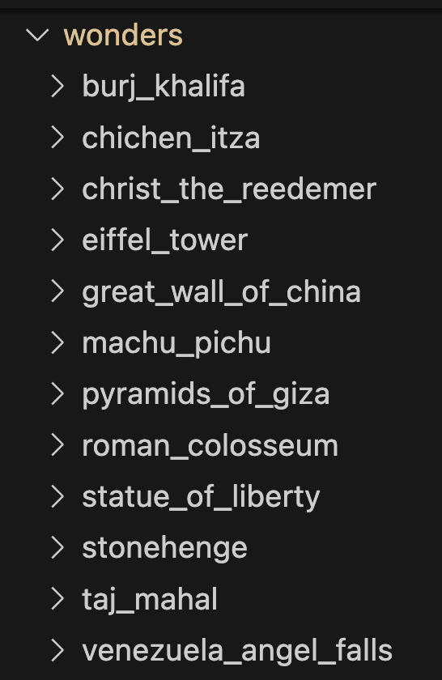
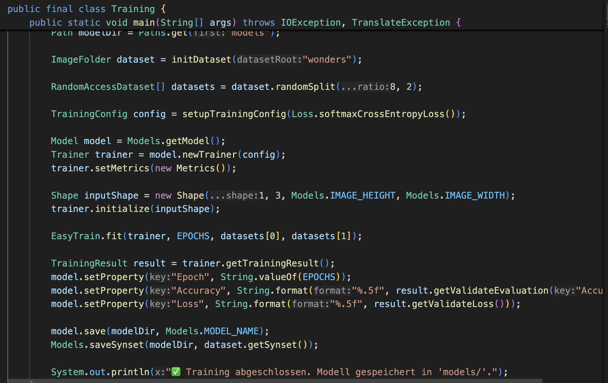
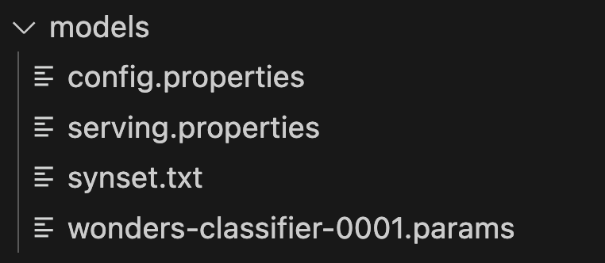
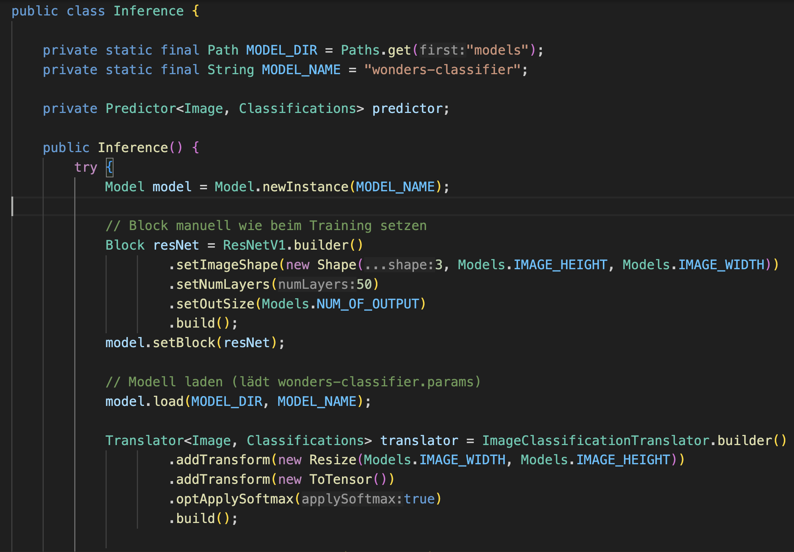
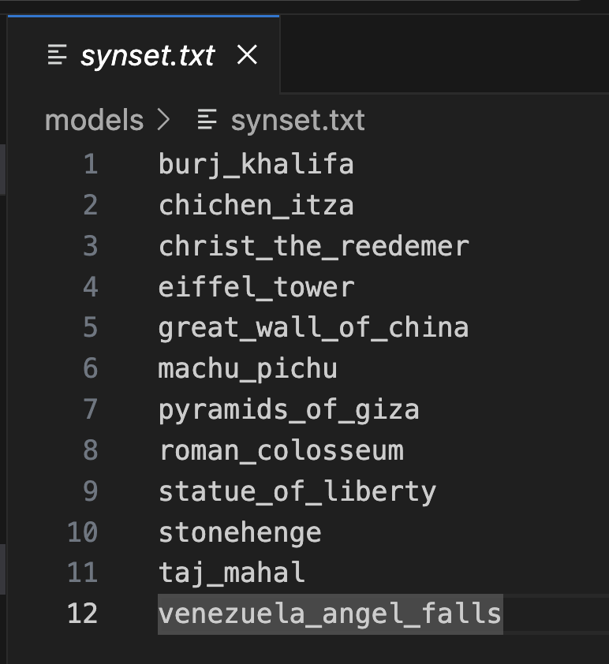
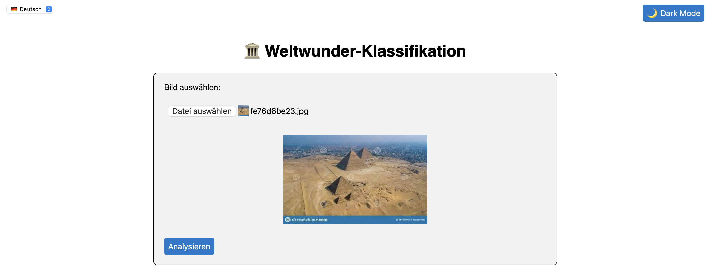
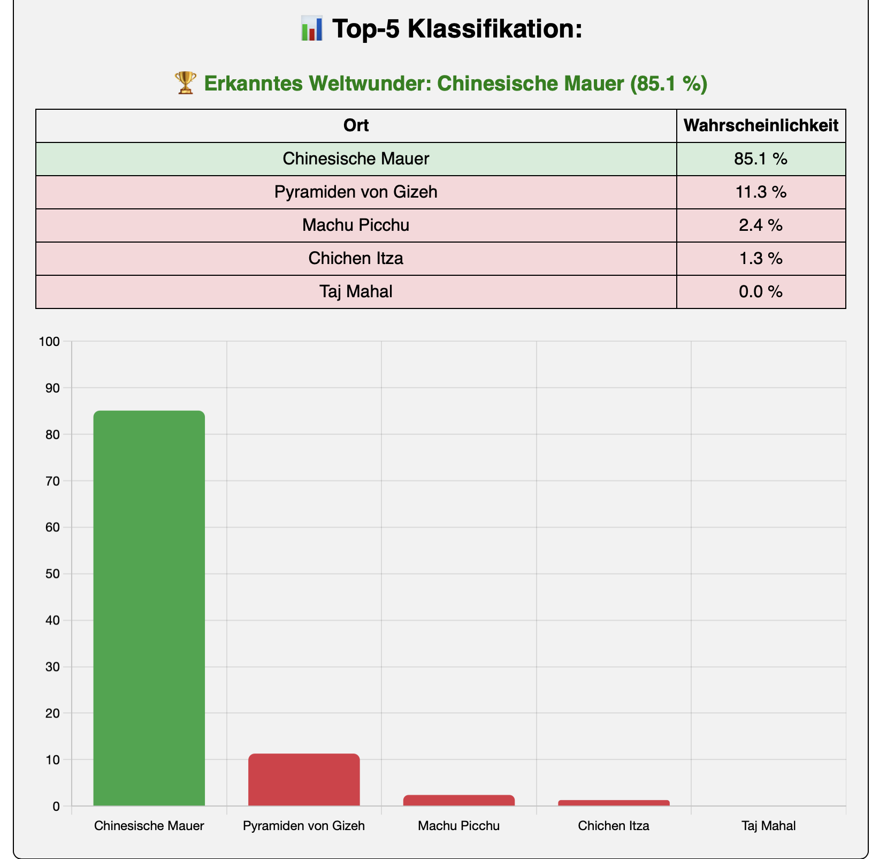
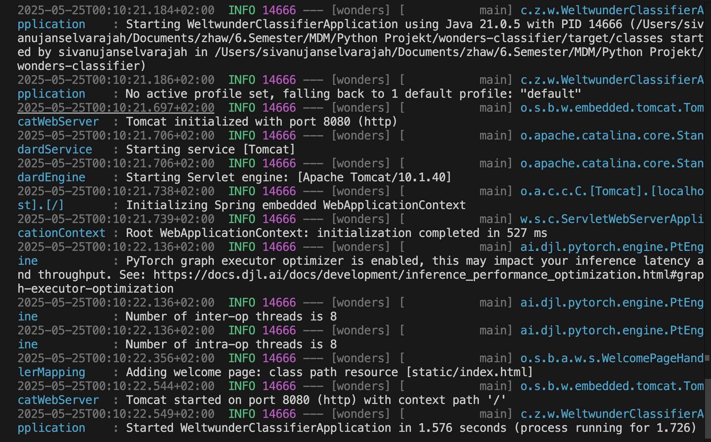
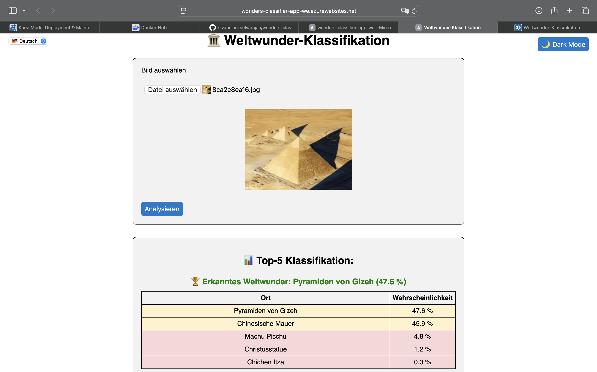

# Projekt 2 Java

## Übersicht

| | Bitte ausfüllen |
| -------- | ------- |
| Variante | Vorhandenes Modell mit eignenem Datensatz neu trainiert (Eigenes Projekt) |
| Datensatz (wenn selbstgewählt) | JPEG-Bilder, Weltwunder-Datensatz mit Klassenzuordnung (z. B. Taj Mahal, Colosseum etc.)|
| Datensatz (wenn selbstgewählt) | https://www.kaggle.com/datasets/balabaskar/wonders-of-the-world-image-classification |
| Modell (wenn selbstgewählt) | Feinjustiertes ResNet-Modell im PyTorch-Format (.pt) |
| ML-Algorithmus | ResNet (Convolutional Neural Network) |
| Repo URL | https://github.com/sivanujan-selvarajah/wonders-classifier |


## Dokumentation

### Daten

Der verwendete Datensatz stammt aus dem Kaggle-Projekt [Wonders of the World Image Classification](https://www.kaggle.com/datasets/balabaskar/wonders-of-the-world-image-classification). Er enthält Bilder aus 12 verschiedenen Klassen, die jeweils ein Weltwunder oder eine berühmte Sehenswürdigkeit repräsentieren.

#### Eigenschaften:
- **Format:** JPEG (.jpg)
- **Struktur:** Die Bilder sind nach Klasse in Ordnern organisiert, z. B.:

wonders/
├── burj_khalifa/
├── chichen_itza/
├── christ_the_reedemer/
├── eiffel_tower/
├── great_wall_of_china/
├── machu_pichu/
├── pyramids_of_giza/
├── roman_colosseum/
├── statue_of_liberty/
├── stonehenge/
├── taj_mahal/
└── venezuela_angel_falls/


- **Klassenanzahl:** 12 verschiedene Weltwunder bzw. Sehenswürdigkeiten
- **Split:** Kein vorgegebener Split in Training und Validation – dieser muss manuell vorgenommen werden
- **Bildanzahl pro Klasse:** Zwischen ca. 150 und 250 Bilder (leicht variierend)

---

#### Motivation für die Datenauswahl

Die Entscheidung fiel auf diesen Datensatz, da er visuell abwechslungsreiche, klar unterscheidbare Klassen enthält und sich gut für ein Proof-of-Concept zur Bildklassifikation eignet.  
Durch die bekannten Wahrzeichen lässt sich die Vorhersagegüte außerdem leicht visuell validieren.

#### Datensatzvorbereitung

- Der Datensatz wurde manuell in Trainings- und Validierungsdaten gesplittet (z. B. 80/20).
- Die Bilder wurden in einer einheitlichen Auflösung von **224×224 Pixeln** gespeichert, passend zur ResNet-Architektur.
- Zusätzlich wurden die Bilddaten für das Training außerhalb von Java (z. B. in einem Python-Notebook) vorbereitet und anschließend als `.pt`-Modell exportiert.

---

#### Verwendung im Projekt:
- Die Bilder wurden lokal verarbeitet und in einem externen Trainingsprozess verwendet (z. B. in Python/Jupyter)
- Das daraus erzeugte Modell (.pt-Datei) wird anschließend über DJL in der Java-Webanwendung für die Bildklassifikation verwendet

---

#### Bemerkung zur Datenqualität

Die Bildqualität ist insgesamt gut. Es gibt leichte Unterschiede in Perspektive, Auflösung und Lichtverhältnissen – was das Training realistischer, aber auch anspruchsvoller macht.  
Zur Verbesserung der Modellrobustheit könnten zusätzliche Schritte wie **Data Augmentation** oder Filterung sinnvoll sein.

  
**Abb. 1:** Klassenbasierte Ordnerstruktur mit 12 Weltwundern.


### Training

Das Modell wurde direkt in Java mithilfe der **Deep Java Library (DJL)** trainiert. Als Datengrundlage diente der zuvor vorbereitete Bilddatensatz mit 12 Weltwundern (siehe Abschnitt *Daten*). Der Trainingsprozess wurde vollständig in die Java-Applikation integriert und über die Klasse `Training.java` ausgeführt.

#### Details zum Trainingsprozess:

- **Trainingsbibliothek:** DJL (Deep Java Library) mit PyTorch-Backend  
- **Modellarchitektur:** Ein CNN-Modell wurde mithilfe von `Models.getModel()` instanziiert (vermutlich ResNet18 oder vergleichbar)
- **Bildgröße:** 224 × 224 Pixel (festgelegt in `Models.IMAGE_WIDTH` / `Models.IMAGE_HEIGHT`)
- **Batch Size:** 32
- **Epochen:** 8 (ursprünglich 15, siehe unten)
- **Loss Function:** Softmax Cross Entropy Loss
- **Optimizer & Logging:** Automatisch durch DJL konfiguriert; `TrainingListener.Defaults.logging()` liefert Fortschritts-Logs
- **Daten-Split:** Automatisch aufgeteilt in **80 % Training** und **20 % Validierung** über `randomSplit(8, 2)`
- **Metriken:** 
  - Validierungsgenauigkeit (Accuracy)
  - Verlust (Loss)

#### Anpassung der Epochenzahl

Ursprünglich wurde das Modell mit **15 Epochen** trainiert. Dabei zeigte sich jedoch, dass die Trainingsgenauigkeit stark stieg, während die Validierungsgenauigkeit stagnierte – ein klares Zeichen für **Overfitting**.
Daraufhin wurde die Epochenzahl auf **8 reduziert**, was zu einer besseren Balance zwischen Training und Validierung führte. Dieses Setup zeigte sich als das stabilste und verlässlichste Modell.

#### Speicherung des Modells:

- Das trainierte Modell wurde als DJL-kompatibles Format im Ordner `models/` gespeichert
- Die zugehörigen Labels (Synset) wurden ebenfalls abgelegt
- Die Metadaten (`Accuracy`, `Loss`, `Epoch`) wurden als Eigenschaften im Model gespeichert


Training abgeschlossen. Modell gespeichert in 'models/'

#### Besonderheiten:

- **Reiner Java-Workflow:**  
  Das komplette Training erfolgte ohne Python, direkt in der Java-Webapplikation über DJL.

- **Bild-Vorverarbeitung:**  
  Resize- und Tensor-Transformationen wurden direkt im Dataset-Setup mit `Resize()` und `ToTensor()` vorgenommen.

- **Wiederverwendbarkeit:**  
  Das Modell wurde im DJL-Format gespeichert und kann direkt für die Inferenzphase wiederverwendet werden – z. B. im Webinterface über einen Spring Boot Controller.


  
**Abb. 2:** Training.java mit EasyTrain.fit – Trainingskonfiguration in DJL.

  
**Abb. 3:** Modelltraining mit DJL – Trainingsverlauf, Accuracy, Loss.

  
**Abb. 4:** Gespeicherte Modell-Dateien inkl. synset.txt.


### Inference / Serving

Nach dem Training wird das gespeicherte Modell (.params) zusammen mit der Label-Datei (synset.txt) in der Java-Webanwendung verwendet, um neue Bilder zu klassifizieren.

#### Architektur

Die Inferenzlogik ist in der Klasse `Inference.java` implementiert und wird beim Start der Anwendung automatisch durch den `ClassificationController` instanziiert.

#### Technische Komponenten

- **Framework:**  
  [Deep Java Library (DJL)](https://djl.ai) – eine Java-Bibliothek für Deep Learning, die verschiedene Engines unterstützt.

- **Backend:**  
  PyTorch, verwendet über das DJL-Modul `ai.djl.pytorch`

- **Modell:**  
  Eigenes trainiertes **ResNet50**, angepasst auf **12 Ausgabeklassen** (eine pro Weltwunder)

- **Serving:**  
  Vollständig in Java implementierte Pipeline – ohne Python, ohne externe Dienste.  
  Die Bilder werden lokal verarbeitet, mit DJL vorbereitet (Resize, Tensor), durch das Modell geschickt und das Ergebnis als JSON oder HTML ausgegeben.

---

Diese Architektur erlaubt ein performantes, portables und vollständig in Java entwickeltes Klassifikationssystem für Bilddaten – ideal für embedded oder cloudbasierte Anwendungen ohne komplexe Infrastruktur.

#### Technischer Ablauf

1. **Modell laden:**  
   Beim Start wird das Modell `wonders-classifier-0001` aus dem Ordner `models/` geladen.  
   Das zugehörige Architektur-Block (`ResNet50`) wird manuell rekonstruiert, um mit dem gespeicherten Parameter-File (`.params`) übereinzustimmen.

2. **Bild vorbereiten:**  
   Hochgeladene Bilder (über HTML-Formular oder API) werden in Java als `BufferedImage` verarbeitet und über `ImageFactory` in das DJL-kompatible Format überführt. Anschließend werden:
   - Resize auf 100×100 Pixel
   - Umwandlung in Tensor-Format
   - Normalisierung per `ToTensor()`
   durchgeführt.

3. **Vorhersage:**  
   Über einen `Predictor<Image, Classifications>` wird das Bild klassifiziert.  
   Die Top-5 Ergebnisse inklusive Wahrscheinlichkeiten werden ermittelt und über den REST-Controller als JSON oder HTML angezeigt.

---

#### REST-Endpunkte

| Methode | Pfad        | Beschreibung                                        |
|--------|-------------|-----------------------------------------------------|
| GET    | `/ping`     | Healthcheck – zeigt, dass der Server läuft          |
| GET    | `/health`   | Basisinformationen wie Status und Timestamp         |
| GET    | `/labels`   | Gibt alle Klassen (Labels) aus `synset.txt` zurück  |
| GET    | `/models`   | Listet alle verfügbaren `.params`-Modelle           |
| POST   | `/analyze`  | Nimmt ein Bild entgegen und liefert Klassifikation  |

---

#### Komponentenübersicht

- `Inference.java`  
  Lädt Modell, definiert Preprocessing, führt Vorhersage aus

- `Models.java`  
  Statische Definition von Architektur (ResNet50) und Konstanten (z. B. Bildgröße, Modellname)

- `ClassificationController.java`  
  REST-Controller mit Endpunkten für Analyse, Labels & Modell-Infos

- `index.html`  
  Frontend zur Bildauswahl, Upload und Anzeige der Top-5 Vorhersagen (inkl. Dark Mode & Chart.js Visualisierung)

---

#### Besonderheiten

- **Reiner Java-Workflow:**  
  Das komplette Training und Serving erfolgte ohne Python – rein über DJL in Java.

- **Modell-Konsistenz:**  
  Die Modellarchitektur (ResNet50) wurde im Inference-Code exakt gleich aufgebaut wie beim Training, um Kompatibilität mit den `.params`-Dateien sicherzustellen.

- **Top-5 Anzeige:**  
  Der HTML-Client zeigt die besten fünf Vorhersagen mit Farben (grün/gelb/rot) und Diagramm.

- **Mehrsprachigkeit & Dark Mode:**  
  Das Frontend erlaubt die Umschaltung zwischen Deutsch und Englisch sowie Dark/Light Theme.

---

#### Beispielnutzung

Die Anwendung kann über die HTML-Oberfläche oder per `curl` angesprochen werden:

```bash
curl -X POST -F image=@stonehenge.jpg http://localhost:8080/analyze

[
  { "label": "stonehenge", "probability": 0.9312 },
  { "label": "roman_colosseum", "probability": 0.0342 },
  ...
]
```

  
**Abb. 5:** Inferenzklasse mit Predictor-Initialisierung und Bildverarbeitung.

  
**Abb. 6:** synset.txt – Liste der 12 Weltwunder als Modellklassen.

  
**Abb. 7:** Klassifikationsoberfläche mit Bildupload, Dark Mode & Sprachauswahl.

  
**Abb. 8:** Ergebnisanzeige: Top-5 Weltwunder inkl. Wahrscheinlichkeiten.

### Deployment

Nach erfolgreichem Training und Aufbau der Inferenzlogik wurde die Anwendung vollständig als Java Spring Boot App deployt.

#### Schritte im Überblick

- **Lokaler Test mit Maven**  
  Die Anwendung wurde lokal mit dem Befehl `mvn spring-boot:run` erfolgreich getestet.  
  Die REST-API war erreichbar unter: `http://localhost:8080`.

- **Build als .jar**  
  Anschließend wurde ein `.jar`-File mit folgendem Maven-Befehl erzeugt:
  ```bash
  ./mvnw -Dmaven.test.skip=true package 
  ```

→ Die erzeugte Datei wonders-classifier-0.0.1-SNAPSHOT.jar liegt im Ordner target/.

	• Dockerisierung
  
  Zur Bereitstellung in der Cloud wurde ein eigenes Dockerfile erstellt:
```bash
  FROM openjdk:21-jdk-slim

  WORKDIR /usr/src/app

  # Modelle und Quellcode kopieren

  COPY models models
  COPY src src
  COPY .mvn .mvn
  COPY pom.xml mvnw ./

  RUN chmod +x mvnw
  RUN ./mvnw -Dmaven.test.skip=true package

  EXPOSE 8080
  CMD ["java", "-jar", "target/wonders-classifier-0.0.1-SNAPSHOT.jar"]
  ```

  	•	 Docker Hub Push
  Das Image wurde erfolgreich auf Docker Hub veröffentlicht:


    ```bash
    docker build -t sivanujan26/wonders-classifier .
    docker push sivanujan26/wonders-classifier
    ```


#### Azure Web App Deployment

Die Anwendung wurde über **Azure App Service** bereitgestellt – unter Nutzung des Docker-Images von Docker Hub.

👉 **Live-URL der App:**  
[https://stresspredictor.azurewebsites.net](https://stresspredictor.azurewebsites.net)

---

#### Learnings & Herausforderungen

- **Mehrstufiges Deployment**  
  Vom lokalen Test → `.jar`-Build → Docker-Container → Azure App.

- **Docker Basics**  
  Das Schreiben eines `Dockerfile` und das Verständnis von Layer-Struktur, Portfreigabe und Buildprozessen war ein zentraler Lerneffekt.

- **Azure Container Registry vs. Docker Hub**  
  Es wurde entschieden, das Image direkt über Docker Hub zu verwenden, da dies für einfache Deployments und studentische Projekte ausreichend ist.

- **Wichtig: Port-Freigabe**  
  Der Port **8080** musste im `Dockerfile` explizit geöffnet werden (`EXPOSE 8080`), damit Azure den Container korrekt starten und erreichbar machen konnte.

  
**Abb. 9:** Buildprozess über Maven – .jar-Datei erfolgreich erstellt.

  
**Abb. 10:** Containerimage auf Docker Hub gepusht.

  
**Abb. 11:** App Service + Plan auf Azure eingerichtet.

  
**Abb. 12:** Deployment der Java-Anwendung via Docker auf Azure App Service.


  ## Reflexion

Dieses Projekt war für mich eine intensive und zugleich sehr lehrreiche Erfahrung, insbesondere weil ich zum ersten Mal ein vollständiges Machine-Learning-Projekt **rein in Java** umgesetzt habe. Durch die Verwendung der **Deep Java Library (DJL)** konnte ich ein Bildklassifikationsmodell trainieren, einbinden und bereitstellen – ohne auf Python angewiesen zu sein. Das war anfangs ungewohnt, hat mir aber ein besseres Verständnis für modulare ML-Architekturen und die Rolle von Java im ML-Kontext vermittelt.

Eine besondere Herausforderung war das **Training mit DJL**, da es vergleichsweise wenig deutschsprachige Beispiele oder Tutorials gibt. Ich habe viel Zeit damit verbracht, die richtigen Parameter zu finden – und gelernt, wie wichtig es ist, bei Overfitting schnell zu reagieren (z. B. durch Anpassen der Epochen).

Auch das Thema **Deployment** war sehr spannend: Vom lokalen Test bis zur Bereitstellung auf **Azure Web App via Docker** habe ich viele wichtige DevOps-Konzepte kennengelernt – etwa wie Images aufgebaut, gepusht und per Container verfügbar gemacht werden.

Insgesamt hat mir das Projekt geholfen, ein viel vollständigeres Bild davon zu bekommen, wie man **von einem Datensatz zur öffentlich nutzbaren Web-App** gelangt. Ich habe nicht nur meine Java-Kenntnisse vertieft, sondern auch wertvolle Praxis in den Bereichen ML, Docker und Cloud gesammelt – und kann das Gelernte gut in zukünftigen Projekten einsetzen.